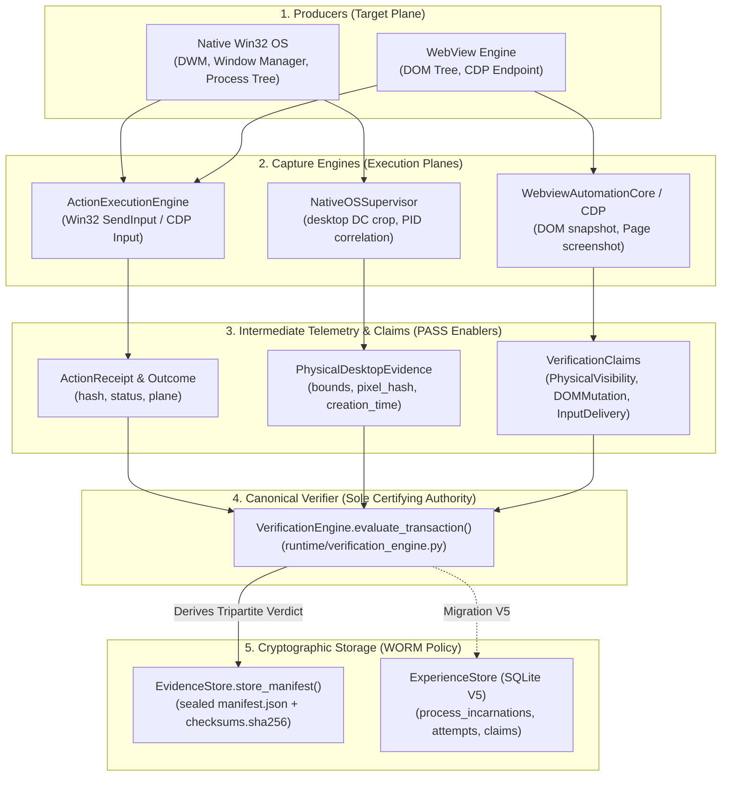

# Authority Graph: Capture Pathways and Verification Flow (Phase 2B Reconciled)

> **Standard:** Architecture Rebuild Plan 2.0 (`Research/34_MASTER_ARCHITECTURE_REBUILD_PLAN.md`)  
> **Status:** FORENSICALLY RECONCILED (Phase 2B Verification Gate)  
> **Mandate:** Define exact trust boundaries, capture pathways, and verification flow across all execution planes.

---

## 1. Capture Authority Trace & Trust Hierarchy

Every capture pathway in the system has a distinct evidentiary authority level:

### A. Win32 GDI: desktop DC (`GetDC(0)` + `BitBlt`)
*   **Producer:** `NativeOSSupervisor.capture_desktop_crop` / `capture_authoritative_physical_desktop` (`runtime/native_supervisor.py`)
*   **API Used:** `user32.GetDC(0)` + `gdi32.BitBlt`
*   **Trust Classification:** `TRUSTED_PHYSICAL_REALITY` (Interim GDI baseline until Phase 4 DXGI/WGC).
*   **Influence on PASS:** High. Authoritative input for `TargetWasPhysicallyVisible` and `ForegroundWindowMatchesTarget`.
*   **Blindspots:** Captures physical pixels but does not prevent occlusions from layered windows during composition; GDI can return black frames on DirectX/DirectComposition hardware surfaces.
*   **Identity Binding Defect:** `capture_authoritative_physical_desktop` currently echoes caller-provided `expected_creation_time` without independently querying the OS for the process creation timestamp of the window.

### B. Win32 GDI: PrintWindow
*   **Producer:** `WindowForensicsEngine.capture_native_window_screenshot` (`core/window_forensics.py`)
*   **API Used:** `user32.PrintWindow(hwnd, hdc_mem, PW_RENDERFULLCONTENT)`
*   **Trust Classification:** `DIAGNOSTIC_ONLY`.
*   **Influence on PASS:** Zero. Never certifiable for physical reality.
*   **Behavior:** Captures window backbuffer even when completely covered or occluded; returns black on hardware-accelerated DirectComposition surfaces.

### C. Win32 GDI: window DC (`GetWindowDC`)
*   **Producer:** `WindowForensicsEngine.capture_native_window_screenshot` (`core/window_forensics.py`)
*   **API Used:** `user32.GetWindowDC(hwnd)` + `gdi32.BitBlt`
*   **Trust Classification:** `DIAGNOSTIC_ONLY`.
*   **Influence on PASS:** Zero. Extremely flaky, captures overlapping windows.

### D. Chromium DevTools Protocol (CDP): `Page.captureScreenshot`
*   **Producer:** `CDPSession` / Playwright (`core/session.py`, `runtime/web_observation.py`)
*   **API Used:** `Page.captureScreenshot`
*   **Trust Classification:** `LOGICAL_DOM_ONLY` (Untrusted for physical desktop reality).
*   **Influence on PASS:** Necessary for DOM element verification (`LEVEL_3_DUAL_PERSPECTIVE_PROOF` / `LEVEL_4_FORENSIC_COMPLETE`), but strictly barred from granting physical visibility alone.
*   **Blindspots:** Renders DOM in memory even if the OS window is cloaked, minimized, behind another window, or off-screen.

### E. DXGI Desktop Duplication & Windows Graphics Capture (WGC)
*   **Planned Migration:** Target architecture for Phase 4.
*   **Trust Classification:** `AUTHORITATIVE_HARDWARE_REALITY` (Eliminates GDI limitations).

---

## 2. Canonical Verification Flow

---

## 3. Trust Invariants & Authority Rules

1. **Single Certifying Authority:** `VerificationEngine` (`runtime/verification_engine.py`) is the **sole** canonical verifier. Rogue certifiers (`RealAppCertifier` in `runtime/certification.py`) violate the architecture contract and must be demoted to non-certifying diagnostics.
2. **Caller Disregard Rule:** The verifier must never trust caller-asserted flags (`is_authoritative=True`, `post_capture_validated=True`). Authority is granted solely by verified runtime origin (`REAL_DESKTOP_SURFACE` via authoritative supervisor).
3. **Identity Coherence Rule:** Process creation time must match across discovery (`TargetManager`), capture (`NativeSupervisor`), and verification (`VerificationEngine`). Sentinel `0.0` or missing creation times must fail closed with `UNVERIFIED` (`PROCESS_IDENTITY_MISMATCH`).
4. **Attempt Lineage Rule:** Every execution cycle must increment `attempt_id`. Evidence must be segregated into `action-{action_id}/attempt-{attempt_id}/`. Write-once immutability must forbid mutation of settled artifacts.
