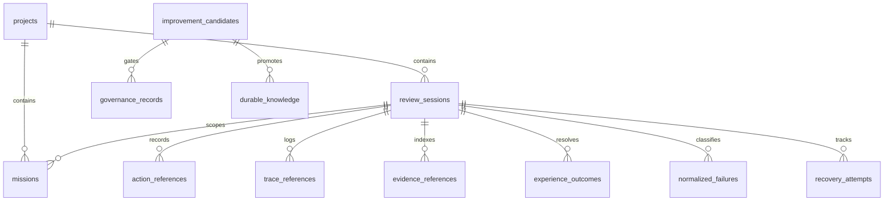
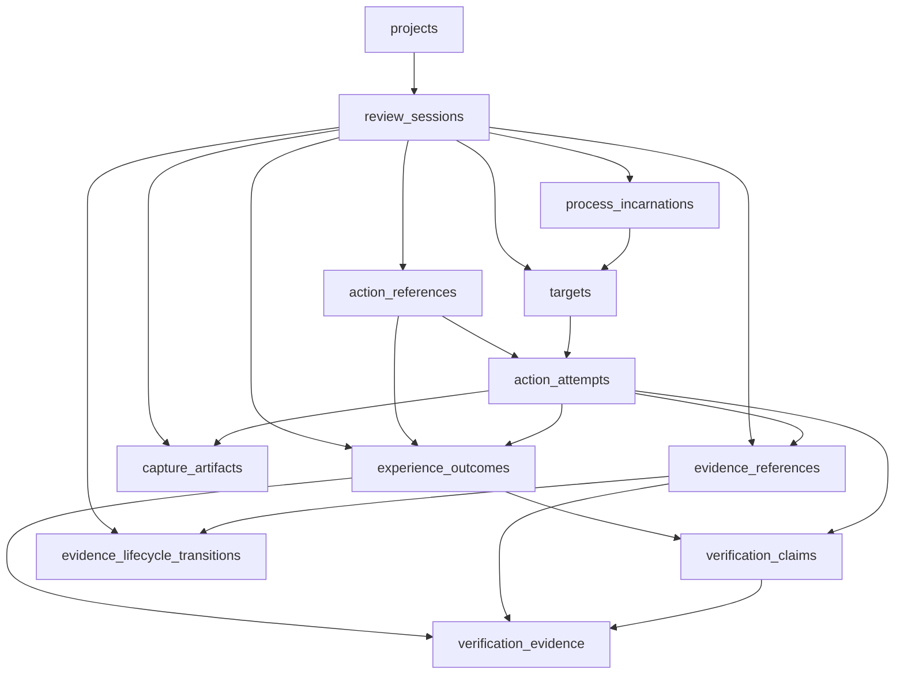
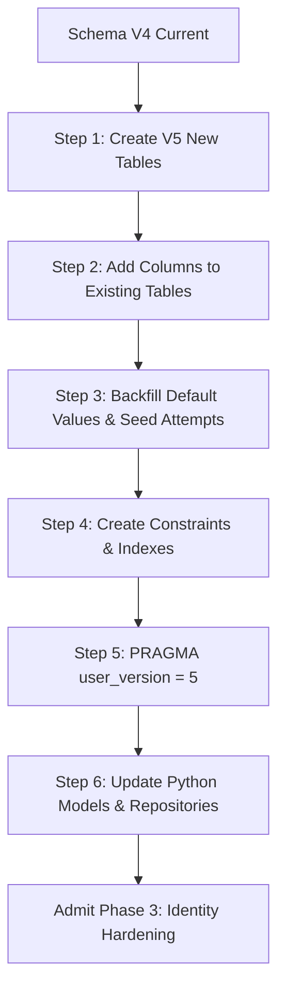

# Phase 2B Database Readiness Assessment: Forensic Persistence Audit

> **Document Type:** Forensic Technical Audit & Migration Specification  
> **Status:** PROPOSED / DRAFT (Pending Phase 3 Gate Approval)  
> **Author:** Database Forensics Engineer  
> **Target Subsystems:** `runtime.experience.schema`, `runtime.experience.store`, `runtime.evidence_store`, `runtime.verification_engine`  
> **Authority Reference:** [34_MASTER_ARCHITECTURE_REBUILD_PLAN.md](file:///c:/Users/Suraj/Documents/Antigravity/Desktop-priview/Research/34_MASTER_ARCHITECTURE_REBUILD_PLAN.md), [35_AGENT_WORKFORCE.md](file:///c:/Users/Suraj/Documents/Antigravity/Desktop-priview/Research/35_AGENT_WORKFORCE.md)  
> **Certification Authority Statement:** In compliance with the Master Workforce Contract, this report represents forensic engineering evidence for architectural decisions. It does **not** declare final certification.

---

## Executive Summary

Phase 2B establishes the foundational claim verification and evidence integrity models across logical (DOM/CDP) and native (Win32/DWM) execution planes. A primary finding of this database forensics audit is that while the Python runtime domain model (`runtime.evidence_models`, `runtime.action_models`, `runtime.target_manager`) has evolved to represent multi-dimensional concepts—such as process creation time, physical desktop evidence, and discrete attempt tracking—the underlying SQLite persistence layer (`runtime.experience.schema`, currently at schema version 4) remains partially aligned to early Milestone 2.1 specifications.

Specifically:
- **`Session`** is fully realized and correct (`EXISTS_AND_CORRECT`).
- **`Target`**, **`Action`**, **`Evidence`**, **`Artifact`**, and **`Verification`** exist in the schema but are denormalized, incomplete, or vulnerable to mutation (`EXISTS_BUT_INCOMPLETE`).
- **`Process Incarnation`**, **`Action Attempt`**, and **`Evidence Lifecycle`** are completely absent as relational entities or first-class columns (`MISSING`), resulting in critical vulnerabilities such as PID recycling blindspots and in-place attempt overwriting.

This audit establishes the minimum required migration schema (Migration V5) necessary before Phase 3 (Identity Hardening) can be safely admitted.

---

## Concept Mapping & Classification Matrix

The following matrix maps the 9 core Phase 2 architectural concepts to their current representations across models, database tables, and forensic classifications:

| Concept | Python Model / Runtime Representation | Database Table / Column Representation | Forensic Classification | Key Deficiency / Gap |
| :--- | :--- | :--- | :--- | :--- |
| **1. Target** | `core.models.Target`<br>`runtime.target_manager.ProcessIdentity`<br>`runtime.target_manager.WindowIdentity`<br>`runtime.action_models.ActionTarget` | `review_sessions.target_executable`<br>`review_sessions.target_pid`<br>`review_sessions.target_hwnd`<br>`review_sessions.target_plane`<br>`action_references.target` | **`EXISTS_BUT_INCOMPLETE`** | No dedicated normalized `targets` table. Multi-window, child frames, and dynamic window re-parenting cannot be tracked across time. |
| **2. Process Incarnation** | `runtime.evidence_models.ProcessIncarnation`<br>`runtime.evidence_models.PhysicalDesktopEvidence.process_creation_time`<br>`runtime.target_manager.ProcessIdentity.creation_time` | *None* (omitted from `review_sessions`, `action_references`, `evidence_references`) | **`MISSING`** | Lacks first-class column or table for process creation time. Vulnerable to PID recycling across process crashes and re-spawns. |
| **3. Session** | `runtime.experience.models.SessionExperienceRecord`<br>`core.session.CDPSession` | `review_sessions`<br>`agent_sessions` | **`EXISTS_AND_CORRECT`** | Sound relational entity with primary key, lifecycle status, project association, runtime version, and metadata. |
| **4. Action** | `runtime.action_models.ActionRequest`<br>`runtime.action_models.ActionReceipt`<br>`runtime.action_models.ActionOutcome`<br>`runtime.experience.models.ActionReferenceRecord` | `action_references` | **`EXISTS_BUT_INCOMPLETE`** | Row is updated in-place via `UPDATE action_references ... WHERE id = ?`. Conflates `REQUESTED`, `DISPATCHED`, and `SETTLED` into a single mutable record. |
| **5. Action Attempt** | `runtime.evidence_models.EvidenceItem.attempt_id`<br>`runtime.evidence_models.EvidenceManifest.attempt_id`<br>`runtime.evidence_store.EvidenceStore.get_action_dir` | *None* (`action_references` and `evidence_references` lack `attempt_id`) | **`MISSING`** | No `action_attempts` table. Failed attempts are overwritten on retry, violating Rebuild Plan §12 and §16. |
| **6. Evidence** | `runtime.evidence_models.EvidenceItem`<br>`runtime.evidence_models.PhysicalDesktopEvidence`<br>`runtime.evidence_models.ScreenshotEvidence`<br>`runtime.evidence_models.EvidenceManifest` | `evidence_references`<br>`observations` | **`EXISTS_BUT_INCOMPLETE`** | `evidence_references` lacks `attempt_id`, `evidence_type`, `proof_level`, `is_authoritative`, and `lifecycle_stage`. |
| **7. Artifact** | `runtime.evidence_models.EvidenceArtifact`<br>`runtime.evidence_store.EvidenceStore` | Embedded in `evidence_references` (`artifact_id`, `checksum_sha256`, `relative_path_or_uri`) | **`EXISTS_BUT_INCOMPLETE`** | Conflated with evidence envelope. No normalized `capture_artifacts` table tracking capture backend, geometry, format, or DPI. |
| **8. Evidence Lifecycle** | Rebuild Plan §13 (`RAW -> OBSERVED -> VALIDATED -> SEALED -> CERTIFIABLE`) | *None* in `evidence_references`. Default string `'OBSERVED'` in `observations`. | **`MISSING`** | No lifecycle stage column in evidence records; no state transition enforcement or audit trail at the persistence layer. |
| **9. Verification** | `runtime.evidence_models.VerificationVerdict`<br>`runtime.evidence_models.VerificationClaim`<br>`runtime.verification_engine.VerificationEngine` | `experience_outcomes` | **`EXISTS_BUT_INCOMPLETE`** | `experience_outcomes` stores session verdict, but lacks relational `action_id`, `attempt_id`, discrete `claims` table, and `verification_evidence` join table. Overwrites on conflict. |

---

## 1. Current Schema

The database persistence subsystem is implemented via Python's standard `sqlite3` driver in [`runtime/experience/schema.py`](file:///c:/Users/Suraj/Documents/Antigravity/Desktop-priview/runtime/experience/schema.py) and managed by [`runtime/experience/store.py`](file:///c:/Users/Suraj/Documents/Antigravity/Desktop-priview/runtime/experience/store.py).

### 1.1 Schema Version & Engine Configuration
- **Current Version:** `CURRENT_SCHEMA_VERSION = 4` tracked via `PRAGMA user_version`.
- **Database Location:** Resolved outside the repository tree by [`runtime/experience/config.py`](file:///c:/Users/Suraj/Documents/Antigravity/Desktop-priview/runtime/experience/config.py):
  - Windows: `%LOCALAPPDATA%\DesktopWebViewReviewer\experience\experience.db`
  - POSIX: `~/.local/share/DesktopWebViewReviewer/experience/experience.db`
- **Active PRAGMAs:**
  - `PRAGMA foreign_keys = ON;`
  - `PRAGMA busy_timeout = 5000;` (5000ms retry for concurrent access)
  - `PRAGMA journal_mode = WAL;` (Write-Ahead Logging enabled for concurrency)
  - `PRAGMA synchronous = NORMAL;` (Ensures durability while avoiding fsync thrashing)

### 1.2 Table Inventory (23 Tables across 4 Migrations)



1. **Migration V1 (Baseline Store):**
   - `schema_migrations` (`version INTEGER PRIMARY KEY, applied_at TEXT, description TEXT`)
   - `installation_metadata` (`installation_id TEXT PRIMARY KEY, runtime_version TEXT, schema_version INTEGER, created_at TEXT, updated_at TEXT, metadata_json TEXT`)
   - `projects` (`project_id TEXT PRIMARY KEY, name TEXT, root_path TEXT, created_at TEXT, metadata_json TEXT`)
   - `review_sessions` (`session_id TEXT PRIMARY KEY, project_id TEXT, created_at TEXT, completed_at TEXT, status TEXT, target_executable TEXT, target_pid INTEGER, target_hwnd TEXT, target_plane TEXT, runtime_version TEXT, scope TEXT, metadata_json TEXT`)
   - `missions` (`mission_id TEXT PRIMARY KEY, session_id TEXT, project_id TEXT, goal TEXT, scope TEXT, created_at TEXT, completed_at TEXT, status TEXT, metadata_json TEXT`)
   - `action_references` (`id INTEGER PRIMARY KEY AUTOINCREMENT, action_id TEXT, session_id TEXT, action_type TEXT, plane TEXT, target TEXT, status TEXT, duration_ms REAL, source TEXT, source_type TEXT, kind TEXT, confidence REAL, timestamp REAL, iso_timestamp TEXT, evidence_reference TEXT, trace_reference TEXT, metadata_json TEXT`)
   - `trace_references` (`id INTEGER PRIMARY KEY AUTOINCREMENT, event_id TEXT, session_id TEXT, sequence_monotonic INTEGER, event_type TEXT, plane TEXT, source TEXT, timestamp REAL, iso_timestamp TEXT, metadata_json TEXT`)
   - `evidence_references` (`id INTEGER PRIMARY KEY AUTOINCREMENT, evidence_id TEXT, session_id TEXT, action_id TEXT, artifact_id TEXT, artifact_type TEXT, checksum_sha256 TEXT, relative_path_or_uri TEXT, source TEXT, timestamp REAL, iso_timestamp TEXT, metadata_json TEXT`)
   - `experience_outcomes` (`outcome_id TEXT PRIMARY KEY, session_id TEXT, verdict TEXT, confidence REAL, error_category TEXT, source TEXT, source_type TEXT, kind TEXT, timestamp REAL, iso_timestamp TEXT, evidence_reference TEXT, trace_reference TEXT, details_json TEXT`)
2. **Migration V2 (Failures & Recoveries):**
   - `normalized_failures` (`failure_id TEXT PRIMARY KEY, session_id TEXT, mission_id TEXT, action_id TEXT, category TEXT, original_classification TEXT, signature TEXT, confidence REAL, source TEXT, source_type TEXT, kind TEXT, recovery_reference TEXT, trace_reference TEXT, evidence_reference TEXT, timestamp REAL, iso_timestamp TEXT, safe_context_json TEXT`)
   - `recovery_attempts` (`recovery_id TEXT PRIMARY KEY, session_id TEXT, action_id TEXT, failure_id TEXT, failure_category TEXT, recovery_action TEXT, attempt_number INTEGER, max_attempts INTEGER, result TEXT, duration_ms REAL, source TEXT, source_type TEXT, kind TEXT, error TEXT, evidence_refs_json TEXT, trace_event_id TEXT, timestamp REAL, iso_timestamp TEXT, metadata_json TEXT`)
3. **Migration V3 (Agent Bridge & Correlations):**
   - `agent_sessions`, `agent_turns`, `agent_tool_calls`, `agent_subagents`, `agent_artifacts`, `agent_corrections`, `agent_dwr_correlations`
4. **Migration V4 (Learning & Governance):**
   - `observations`, `detected_patterns`, `improvement_candidates`, `governance_records`, `durable_knowledge`

---

## 2. Existing Relevant Tables

Of the 23 tables, the following 6 tables directly store Phase 2 runtime verification facts:

### 2.1 `review_sessions`
- **Purpose:** Tracks the high-level execution context of a desktop application review run.
- **Current Columns:** `session_id`, `project_id`, `created_at`, `completed_at`, `status`, `target_executable`, `target_pid`, `target_hwnd`, `target_plane`, `runtime_version`, `scope`, `metadata_json`.
- **Foreign Keys:** `FOREIGN KEY (project_id) REFERENCES projects(project_id) ON DELETE SET NULL`.
- **Forensic Assessment:** Captures process ID (`target_pid`) and window handle (`target_hwnd`), but fails to capture the process start time (`target_creation_time`). When an application crashes and Windows recycles the PID, new operations in the same or subsequent session cannot prove whether they targeted the original incarnation.

### 2.2 `action_references`
- **Purpose:** Stores records of user/agent actions dispatched against targets.
- **Current Columns:** `id` (AUTOINCREMENT PK), `action_id`, `session_id`, `action_type`, `plane`, `target`, `status`, `duration_ms`, `source`, `source_type`, `kind`, `confidence`, `timestamp`, `iso_timestamp`, `evidence_reference`, `trace_reference`, `metadata_json`.
- **Foreign Keys:** `FOREIGN KEY (session_id) REFERENCES review_sessions(session_id) ON DELETE CASCADE`.
- **Forensic Assessment:** The runtime engine ([`runtime/experience/store.py:310-335`](file:///c:/Users/Suraj/Documents/Antigravity/Desktop-priview/runtime/experience/store.py#L310-L335)) performs in-place `UPDATE` when an existing `(action_id, session_id)` tuple is encountered. Consequently, transitional milestones (`ACTION_REQUESTED`, `ACTION_DISPATCHED`, `ACTION_SETTLED`) overwrite earlier rows. There is no `attempt_id` column; retried actions destroy previous execution records.

### 2.3 `evidence_references`
- **Purpose:** Stores forensic pointers and SHA-256 digests for disk-stored evidence artifacts.
- **Current Columns:** `id` (AUTOINCREMENT PK), `evidence_id`, `session_id`, `action_id`, `artifact_id`, `artifact_type`, `checksum_sha256`, `relative_path_or_uri`, `source`, `timestamp`, `iso_timestamp`, `metadata_json`.
- **Foreign Keys:** `FOREIGN KEY (session_id) REFERENCES review_sessions(session_id) ON DELETE CASCADE`.
- **Forensic Assessment:** Accurately implements the rule **"never store binary blobs in SQLite"**. However, it lacks an `attempt_id` link, lacks an explicit `is_authoritative` flag, lacks a `proof_level` column, and does not record the process creation timestamp.

### 2.4 `experience_outcomes`
- **Purpose:** Stores tripartite verdicts (`PASS`, `FAIL`, `UNVERIFIED`) derived from verification runs.
- **Current Columns:** `outcome_id` (PK), `session_id`, `verdict`, `confidence`, `error_category`, `source`, `source_type`, `kind`, `timestamp`, `iso_timestamp`, `evidence_reference`, `trace_reference`, `details_json`.
- **Foreign Keys:** `FOREIGN KEY (session_id) REFERENCES review_sessions(session_id) ON DELETE CASCADE`.
- **Forensic Assessment:** Contains no top-level `action_id` or `attempt_id` column (these are concatenated into strings or dumped into `details_json`). Crucially, [`runtime/experience/store.py:473`](file:///c:/Users/Suraj/Documents/Antigravity/Desktop-priview/runtime/experience/store.py#L473) executes `ON CONFLICT(outcome_id) DO UPDATE SET verdict = excluded.verdict`, allowing subsequent executions to overwrite a prior verdict.

### 2.5 `recovery_attempts`
- **Purpose:** Captures recovery operations executed after a failure classification.
- **Current Columns:** `recovery_id` (PK), `session_id`, `action_id`, `failure_id`, `failure_category`, `recovery_action`, `attempt_number`, `max_attempts`, `result`, `duration_ms`, `source`, `source_type`, `kind`, `error`, `evidence_refs_json`, `trace_event_id`, `timestamp`, `iso_timestamp`, `metadata_json`.
- **Forensic Assessment:** Correctly models attempt numbers for recovery operations, but is distinct from primary action execution attempts.

### 2.6 `observations` (Migration V4)
- **Purpose:** Stores normalized patterns and state facts observed during execution.
- **Current Columns:** `observation_id` (PK), `observation_type`, `scope`, `project_id`, `session_id`, `signature`, `occurrence_count`, `confidence`, `status`, `first_observed_at`, `last_observed_at`, `first_observed_ts`, `last_observed_ts`, `source_refs_json`, `provenance_json`, `details_json`.
- **Forensic Assessment:** Represents general intelligence observations rather than physical-desktop evidence envelopes.

---

## 3. Missing Entities

To fulfill Section 16 of the Master Architecture Rebuild Plan (*"Normalize around: sessions, targets, missions, claims, actions, action_attempts, observations, physical_observations, capture_artifacts, input_receipts, verifications, verification_evidence"*), the following 7 entities must be introduced into the schema:

### 3.1 `targets`
Represents individual inspectable UI surfaces (top-level windows, child controls, embedded webviews, webview processes).
- Resolves the current problem where targets are flattened into text strings on `review_sessions` and `action_references`.
- Enables tracking multi-target architectures (e.g. Electron apps with multiple webContents or hybrid Qt+CEF desktop shells).

### 3.2 `process_incarnations`
Explicitly binds an operating system process to its exact birth timestamp: `(pid, process_creation_time)`.
- Eliminates PID recycling vulnerabilities.
- Guarantees that evidence collected at timestamp $t_2$ cannot certify an action dispatched at $t_1$ if the target process died and was replaced by an unrelated process with the same PID.

### 3.3 `action_attempts`
Records every single physical or logical execution attempt for an action.
- Separates the **Action Intent** (`actions`) from the **Execution Attempt** (`action_attempts`).
- Invariant: Retries generate *new rows* (`attempt_number = 2`, `attempt_number = 3`). Existing attempt rows are strictly immutable.

### 3.4 `capture_artifacts`
Normalizes raw screen capture metadata away from generic evidence references.
- Records the capture backend (`GDI_DESKTOP`, `DXGI_DUPLICATION`, `WINDOWS_GRAPHICS_CAPTURE`, `PRINT_WINDOW_DIAGNOSTIC`).
- Documents physical dimensions, pixel format (`RGBA`, `BGRA`), capture coordinate bounds, DPI context, and SHA-256 byte digest.

### 3.5 `verification_claims`
Stores individual claims evaluated by [`runtime/verification_engine.py`](file:///c:/Users/Suraj/Documents/Antigravity/Desktop-priview/runtime/verification_engine.py) (`ActionWasDispatched`, `InputReachedTarget`, `TargetWasPhysicallyVisible`, `ExpectedStateOccurred`).
- Enables granular querying of *why* an action received an `UNVERIFIED` verdict.
- Records expected state, actual state, confidence, and discrete `unverified_reason`.

### 3.6 `verification_evidence`
Many-to-many join table connecting `experience_outcomes` and `verification_claims` to the exact `evidence_references` used to substantiate the verdict.
- Provides cryptographic lineage: enables any verifier to inspect the exact subset of evidence items that led to a `PASS` or `FAIL`.

### 3.7 `evidence_lifecycle_transitions`
Audit log tracking the lifecycle progression of an evidence record:
$$\text{RAW} \longrightarrow \text{OBSERVED} \longrightarrow \text{VALIDATED} \longrightarrow \text{SEALED} \longrightarrow \text{CERTIFIABLE}$$
- Guarantees that unsealed evidence cannot be promoted directly to certifying evidence.

---

## 4. Required Columns

### 4.1 Modifications to Existing Tables

#### Table: `review_sessions`
| Column Name | Type | Constraints | Default | Purpose |
| :--- | :--- | :--- | :--- | :--- |
| `target_creation_time` | `REAL` | `NULL` | `NULL` | Anchors the process creation time at discovery to prevent PID recycling |
| `process_incarnation_id`| `TEXT` | `NULL` | `NULL` | Foreign key reference to `process_incarnations(incarnation_id)` |

#### Table: `action_references`
| Column Name | Type | Constraints | Default | Purpose |
| :--- | :--- | :--- | :--- | :--- |
| `attempt_id` | `TEXT` | `NOT NULL` | `'att_default'` | Binds the action record to an execution attempt |
| `attempt_number` | `INTEGER` | `NOT NULL` | `1` | Monotonic index of the attempt for this action |
| `lifecycle_stage` | `TEXT` | `NOT NULL` | `'DISPATCHED'` | Lifecycle milestone (`REQUESTED`, `DISPATCHED`, `SETTLED`) |
| `risk_level` | `TEXT` | `NOT NULL` | `'INTERACTIVE'` | Risk category (`LOW_RISK`, `INTERACTIVE`, `POTENTIALLY_DESTRUCTIVE`) |

#### Table: `evidence_references`
| Column Name | Type | Constraints | Default | Purpose |
| :--- | :--- | :--- | :--- | :--- |
| `attempt_id` | `TEXT` | `NULL` | `NULL` | Links evidence directly to a specific action attempt |
| `evidence_type` | `TEXT` | `NOT NULL` | `'NATIVE_SCREENSHOT'` | Normalized category from `runtime.evidence_models.EvidenceType` |
| `proof_level` | `TEXT` | `NOT NULL` | `'LEVEL_3_DUAL_PERSPECTIVE_PROOF'` | Required proof level |
| `is_authoritative` | `INTEGER` | `NOT NULL` | `0` | Boolean (0/1): whether evidence originated from an approved certifying backend |
| `lifecycle_stage` | `TEXT` | `NOT NULL` | `'RAW'` | Lifecycle stage (`RAW`, `OBSERVED`, `VALIDATED`, `SEALED`, `CERTIFIABLE`) |
| `process_creation_time` | `REAL` | `NOT NULL` | `0.0` | Birth timestamp of the observed process |
| `target_hwnd` | `TEXT` | `NULL` | `NULL` | Hexadecimal HWND string of the target window |

#### Table: `experience_outcomes`
| Column Name | Type | Constraints | Default | Purpose |
| :--- | :--- | :--- | :--- | :--- |
| `action_id` | `TEXT` | `NULL` | `NULL` | First-class relational foreign key to `action_references(action_id)` |
| `attempt_id` | `TEXT` | `NULL` | `NULL` | First-class foreign key to `action_attempts(attempt_id)` |
| `proof_level` | `TEXT` | `NOT NULL` | `'LEVEL_3_DUAL_PERSPECTIVE_PROOF'` | Proof level achieved |
| `unverified_reason` | `TEXT` | `NULL` | `NULL` | Normalized reason enum from `runtime.evidence_models.UnverifiedReason` |

### 4.2 Definitions of New Tables

```sql
-- 1. Process Incarnations Table
CREATE TABLE IF NOT EXISTS process_incarnations (
    incarnation_id TEXT PRIMARY KEY,
    session_id TEXT NOT NULL,
    pid INTEGER NOT NULL,
    process_creation_time REAL NOT NULL,
    binary_path TEXT NOT NULL,
    command_line_json TEXT,
    is_elevated INTEGER NOT NULL DEFAULT 0,
    created_at TEXT NOT NULL,
    FOREIGN KEY (session_id) REFERENCES review_sessions(session_id) ON DELETE CASCADE
);

-- 2. Targets Table
CREATE TABLE IF NOT EXISTS targets (
    target_id TEXT PRIMARY KEY,
    session_id TEXT NOT NULL,
    incarnation_id TEXT,
    target_type TEXT NOT NULL,          -- 'TOP_LEVEL_WINDOW', 'CHILD_CONTROL', 'WEBVIEW_PAGE', 'FRAME'
    title TEXT,
    url TEXT,
    engine TEXT,
    native_hwnd TEXT,
    cdp_target_id TEXT,
    bounds_json TEXT,
    created_at TEXT NOT NULL,
    FOREIGN KEY (session_id) REFERENCES review_sessions(session_id) ON DELETE CASCADE,
    FOREIGN KEY (incarnation_id) REFERENCES process_incarnations(incarnation_id) ON DELETE SET NULL
);

-- 3. Action Attempts Table
CREATE TABLE IF NOT EXISTS action_attempts (
    attempt_id TEXT PRIMARY KEY,
    action_id TEXT NOT NULL,
    session_id TEXT NOT NULL,
    target_id TEXT,
    attempt_number INTEGER NOT NULL,
    dispatch_method TEXT NOT NULL,       -- 'PHYSICAL_INPUT', 'CDP_INPUT', 'NATIVE_SENDINPUT'
    dispatch_status TEXT NOT NULL,       -- 'DISPATCHED', 'REJECTED', 'FAILED'
    preconditions_passed INTEGER NOT NULL DEFAULT 0,
    duration_ms REAL,
    error_message TEXT,
    receipt_json TEXT,
    created_at TEXT NOT NULL,
    iso_timestamp TEXT NOT NULL,
    FOREIGN KEY (session_id) REFERENCES review_sessions(session_id) ON DELETE CASCADE,
    FOREIGN KEY (target_id) REFERENCES targets(target_id) ON DELETE SET NULL
);

-- 4. Capture Artifacts Table
CREATE TABLE IF NOT EXISTS capture_artifacts (
    artifact_id TEXT PRIMARY KEY,
    evidence_id TEXT,
    session_id TEXT NOT NULL,
    attempt_id TEXT,
    capture_backend TEXT NOT NULL,       -- 'GDI_DESKTOP', 'DXGI_DUPLICATION', 'WGC', 'PRINT_WINDOW'
    coordinate_space TEXT NOT NULL,      -- 'SCREEN_PHYSICAL', 'WINDOW_EXTENDED_FRAME', 'VIEWPORT_LOGICAL'
    width INTEGER NOT NULL,
    height INTEGER NOT NULL,
    pixel_format TEXT NOT NULL DEFAULT 'RGBA',
    dpi_scaling REAL NOT NULL DEFAULT 1.0,
    capture_duration_ms REAL,
    checksum_sha256 TEXT NOT NULL,
    relative_path TEXT NOT NULL,
    is_authoritative INTEGER NOT NULL DEFAULT 0,
    created_at TEXT NOT NULL,
    FOREIGN KEY (session_id) REFERENCES review_sessions(session_id) ON DELETE CASCADE,
    FOREIGN KEY (attempt_id) REFERENCES action_attempts(attempt_id) ON DELETE SET NULL
);

-- 5. Verification Claims Table
CREATE TABLE IF NOT EXISTS verification_claims (
    claim_id TEXT PRIMARY KEY,
    outcome_id TEXT NOT NULL,
    session_id TEXT NOT NULL,
    action_id TEXT NOT NULL,
    attempt_id TEXT,
    claim_type TEXT NOT NULL,           -- 'ActionWasDispatched', 'TargetWasPhysicallyVisible', etc.
    status TEXT NOT NULL,               -- 'PASS', 'FAIL', 'UNVERIFIED'
    confidence REAL NOT NULL DEFAULT 1.0,
    unverified_reason TEXT,
    expected_json TEXT,
    actual_json TEXT,
    evaluation_details TEXT,
    created_at TEXT NOT NULL,
    FOREIGN KEY (outcome_id) REFERENCES experience_outcomes(outcome_id) ON DELETE CASCADE,
    FOREIGN KEY (session_id) REFERENCES review_sessions(session_id) ON DELETE CASCADE,
    FOREIGN KEY (attempt_id) REFERENCES action_attempts(attempt_id) ON DELETE SET NULL
);

-- 6. Verification Evidence Link Table
CREATE TABLE IF NOT EXISTS verification_evidence (
    id INTEGER PRIMARY KEY AUTOINCREMENT,
    outcome_id TEXT NOT NULL,
    evidence_id TEXT NOT NULL,
    claim_id TEXT,
    role TEXT NOT NULL DEFAULT 'PRIMARY_PROOF', -- 'PRIMARY_PROOF', 'PRE_STATE', 'POST_STATE', 'CONTRADICTION'
    linked_at TEXT NOT NULL,
    FOREIGN KEY (outcome_id) REFERENCES experience_outcomes(outcome_id) ON DELETE CASCADE,
    FOREIGN KEY (claim_id) REFERENCES verification_claims(claim_id) ON DELETE CASCADE
);

-- 7. Evidence Lifecycle Transitions Table
CREATE TABLE IF NOT EXISTS evidence_lifecycle_transitions (
    transition_id INTEGER PRIMARY KEY AUTOINCREMENT,
    evidence_id TEXT NOT NULL,
    session_id TEXT NOT NULL,
    from_stage TEXT NOT NULL,
    to_stage TEXT NOT NULL,
    transitioned_by TEXT NOT NULL,       -- Component / Agent / Authority
    reason TEXT,
    transition_timestamp REAL NOT NULL,
    iso_timestamp TEXT NOT NULL,
    FOREIGN KEY (session_id) REFERENCES review_sessions(session_id) ON DELETE CASCADE
);
```

---

## 5. Required Uniqueness Constraints

To prevent data corruption, replay vulnerabilities, and file overwrite hazards, the following uniqueness constraints must be enforced:

1. **`process_incarnations`:**
   - `CONSTRAINT uq_process_incarnation UNIQUE (pid, process_creation_time, session_id)`  
     *Rationale:* Prevents duplicate incarnation registrations within the same review session.
2. **`action_attempts`:**
   - `CONSTRAINT uq_action_attempt UNIQUE (action_id, attempt_id)`  
   - `CONSTRAINT uq_action_attempt_number UNIQUE (action_id, attempt_number)`  
     *Rationale:* Guarantees strictly monotonic, non-colliding execution attempts per action.
3. **`evidence_references`:**
   - `CONSTRAINT uq_evidence_artifact UNIQUE (session_id, action_id, attempt_id, artifact_id)`  
     *Rationale:* Eliminates overwrite hazards where multiple attempts reuse artifact identifiers.
4. **`capture_artifacts`:**
   - `CONSTRAINT uq_capture_path UNIQUE (session_id, relative_path)`  
     *Rationale:* Guarantees that every physical file on disk is mapped to exactly one artifact record.
5. **`verification_claims`:**
   - `CONSTRAINT uq_claim_attempt UNIQUE (outcome_id, attempt_id, claim_type)`  
     *Rationale:* Prevents evaluating duplicate claims of the same type for a single attempt.
6. **`verification_evidence`:**
   - `CONSTRAINT uq_verif_evidence_link UNIQUE (outcome_id, evidence_id, claim_id)`  
     *Rationale:* Prevents redundant duplicate links in the evidence association graph.

---

## 6. Required Foreign Keys

Referential integrity must be strictly enforced via `PRAGMA foreign_keys = ON;`. The required foreign key relationships are:



1. **`process_incarnations.session_id`** $\longrightarrow$ `review_sessions(session_id) ON DELETE CASCADE`
2. **`targets.session_id`** $\longrightarrow$ `review_sessions(session_id) ON DELETE CASCADE`
3. **`targets.incarnation_id`** $\longrightarrow$ `process_incarnations(incarnation_id) ON DELETE SET NULL`
4. **`action_attempts.session_id`** $\longrightarrow$ `review_sessions(session_id) ON DELETE CASCADE`
5. **`action_attempts.target_id`** $\longrightarrow$ `targets(target_id) ON DELETE SET NULL`
6. **`capture_artifacts.session_id`** $\longrightarrow$ `review_sessions(session_id) ON DELETE CASCADE`
7. **`capture_artifacts.attempt_id`** $\longrightarrow$ `action_attempts(attempt_id) ON DELETE SET NULL`
8. **`verification_claims.outcome_id`** $\longrightarrow$ `experience_outcomes(outcome_id) ON DELETE CASCADE`
9. **`verification_claims.attempt_id`** $\longrightarrow$ `action_attempts(attempt_id) ON DELETE SET NULL`
10. **`verification_evidence.outcome_id`** $\longrightarrow$ `experience_outcomes(outcome_id) ON DELETE CASCADE`
11. **`verification_evidence.claim_id`** $\longrightarrow$ `verification_claims(claim_id) ON DELETE CASCADE`
12. **`evidence_lifecycle_transitions.session_id`** $\longrightarrow$ `review_sessions(session_id) ON DELETE CASCADE`

---

## 7. Required Indexes

To maintain sub-millisecond query performance during high-throughput verification and prevent table scans during foreign key cascades:

```sql
-- Process Incarnation lookups
CREATE INDEX IF NOT EXISTS idx_proc_inc_pid_time ON process_incarnations(pid, process_creation_time);
CREATE INDEX IF NOT EXISTS idx_proc_inc_session ON process_incarnations(session_id);

-- Target lookups
CREATE INDEX IF NOT EXISTS idx_targets_session ON targets(session_id);
CREATE INDEX IF NOT EXISTS idx_targets_hwnd ON targets(native_hwnd);

-- Action Attempts lookups
CREATE INDEX IF NOT EXISTS idx_attempts_action ON action_attempts(action_id);
CREATE INDEX IF NOT EXISTS idx_attempts_session ON action_attempts(session_id);
CREATE INDEX IF NOT EXISTS idx_attempts_status ON action_attempts(dispatch_status);

-- Evidence References additions
CREATE INDEX IF NOT EXISTS idx_ev_ref_attempt ON evidence_references(attempt_id);
CREATE INDEX IF NOT EXISTS idx_ev_ref_sha256 ON evidence_references(checksum_sha256);
CREATE INDEX IF NOT EXISTS idx_ev_ref_auth ON evidence_references(is_authoritative, lifecycle_stage);

-- Capture Artifacts lookups
CREATE INDEX IF NOT EXISTS idx_artifacts_session ON capture_artifacts(session_id);
CREATE INDEX IF NOT EXISTS idx_artifacts_sha256 ON capture_artifacts(checksum_sha256);
CREATE INDEX IF NOT EXISTS idx_artifacts_backend ON capture_artifacts(capture_backend);

-- Verification Claims lookups
CREATE INDEX IF NOT EXISTS idx_claims_outcome ON verification_claims(outcome_id);
CREATE INDEX IF NOT EXISTS idx_claims_attempt ON verification_claims(attempt_id);
CREATE INDEX IF NOT EXISTS idx_claims_type_status ON verification_claims(claim_type, status);

-- Verification Evidence Join lookups
CREATE INDEX IF NOT EXISTS idx_verif_ev_outcome ON verification_evidence(outcome_id);
CREATE INDEX IF NOT EXISTS idx_verif_ev_evidence ON verification_evidence(evidence_id);
CREATE INDEX IF NOT EXISTS idx_verif_ev_claim ON verification_evidence(claim_id);

-- Lifecycle Transitions lookups
CREATE INDEX IF NOT EXISTS idx_ev_lifecycle_ev_id ON evidence_lifecycle_transitions(evidence_id);
CREATE INDEX IF NOT EXISTS idx_ev_lifecycle_stage ON evidence_lifecycle_transitions(to_stage);
```

---

## 8. Migration Dependencies & Staging Strategy

The schema migration from version 4 to version 5 must follow a strict dependency pipeline to avoid breaking existing test suites or running adapters:



### Staging Steps:
1. **Schema Migration Script (`MIGRATION_V5_STATEMENTS`):**
   - Implemented in `runtime/experience/schema.py` under key `5` in `MIGRATIONS`.
   - Uses `ALTER TABLE ... ADD COLUMN` for nullable or default-valued columns on `review_sessions`, `action_references`, `evidence_references`, and `experience_outcomes`.
   - Executes `CREATE TABLE IF NOT EXISTS` for the 7 new normalized entities.
2. **Backfill & Data Compatibility:**
   - Existing rows in `action_references` are backfilled with `attempt_id = 'att_0'`, `attempt_number = 1`, `lifecycle_stage = 'DISPATCHED'`.
   - Existing rows in `evidence_references` are backfilled with `is_authoritative = 0`, `lifecycle_stage = 'VALIDATED'`.
3. **Repository Updates (`runtime/experience/store.py`):**
   - Refactor `record_action_reference()`: Remove in-place `UPDATE`. Change to append-only insertion linking to `action_attempts`.
   - Refactor `record_outcome()`: Remove `ON CONFLICT(outcome_id) DO UPDATE`. Enforce immutable verdict recording keyed by `(outcome_id, attempt_id)`.
4. **Adapter Updates (`runtime/experience/adapter.py`):**
   - Update `on_action_dispatched()` and `on_action_settled()` to pass `attempt_id`.
   - Wire `expected_creation_time` and `process_creation_time` into evidence creation events.
5. **Phase 3 Prerequisite Gate:**
   - Phase 3 (Identity Hardening) cannot begin until `process_incarnations` and `target_creation_time` columns exist in SQLite, enabling `TargetManager` to record verified process creation timestamps.

---

## 9. Historical Evidence Preservation Requirements

To maintain forensic integrity and prevent evidence tampering or suppression:

1. **Strict Write-Once-Read-Many (WORM) Persistence:**
   - `UPDATE` statements on `evidence_references`, `capture_artifacts`, `verification_claims`, and `verification_evidence` are strictly prohibited.
   - Any attempt to update a sealed evidence record must raise `EvidenceSecurityException`.
2. **Preservation of Failed Attempts:**
   - If an action attempt fails (e.g. timeout, occlusion, missed click, PID mismatch), the attempt record (`action_attempts`), its diagnostic captures (`capture_artifacts`), and its `UNVERIFIED` outcome (`experience_outcomes`) must remain permanently in the database.
   - Subsequent retries must create a new attempt (`attempt_number = 2`) linked to the same `action_id`.
3. **Cryptographic Lineage Sealing:**
   - The database stores only content hashes (`checksum_sha256`), relative URIs, and metadata.
   - Binary image/DOM blobs are stored on disk under `{base_dir}/session-{session_id}/action-{action_id}/attempt-{attempt_id}/`.
   - The database record's SHA-256 must match the byte-for-byte SHA-256 of the disk artifact at all times, verifiable via `ExperienceStore.verify_integrity()`.
4. **Atomic Transaction Isolation:**
   - Verification evaluation, claim recording, and evidence linkage must execute inside an atomic SQLite transaction block (`BEGIN IMMEDIATE ... COMMIT`).
   - If writing evidence references fails, the entire transaction rolls back, preventing orphaned or unverified PASS outcomes.

---

## 10. Forensic Risk Register

| Risk ID | Severity | Failure Scenario | Impact | Mitigation Strategy |
| :--- | :--- | :--- | :--- | :--- |
| **RSK-DB-01** | **CRITICAL** | **PID Recycling False Certification**<br>Target process exits; OS reassigns PID to another process before verification completes. | VerificationEngine mistakenly certifies the wrong process window as visible. | Require `process_creation_time` column in `review_sessions` and `evidence_references`. Compare with microsecond precision against OS `CreateTime`. |
| **RSK-DB-02** | **HIGH** | **In-Place Attempt Overwriting**<br>Retry logic mutates existing row in `action_references` or `experience_outcomes`. | Failed attempt evidence is erased; audit trail is corrupted. | Transition SQLite write routines to append-only insertion keyed by `attempt_id`. Disallow `UPDATE` on action records. |
| **RSK-DB-03** | **HIGH** | **SQLite WAL Lock Contention**<br>Simultaneous tool calls or background monitors attempt writes during live desktop review. | `sqlite3.OperationalError: database is locked` causes execution abort. | Set `PRAGMA busy_timeout = 5000;`. Implement retry backoff in `_get_connection()`. Maintain non-blocking fail-safe mode in `adapter.py`. |
| **RSK-DB-04** | **MEDIUM** | **Timestamp Floating-Point Precision Drift**<br>Python `time.time()` float64 loses sub-millisecond precision when serialized to SQLite `REAL`. | Equality check on `process_creation_time` fails closed as mismatch. | Store timestamps as both `REAL` (for range queries) and exact integer nanoseconds / ISO-8601 strings for exact equality matching. |
| **RSK-DB-05** | **MEDIUM** | **Disk Bloat from Unbounded Capture Artifacts**<br>Full-resolution physical desktop captures consume gigabytes across multi-attempt sessions. | Host machine runs out of disk space; evidence store write fails. | Implement artifact deduplication via `capture_artifacts(checksum_sha256)`. Enforce configurable retention and cleanup policies for diagnostic captures. |
| **RSK-DB-06** | **LOW** | **Unsupported Schema Downgrade**<br>Older runtime version connects to a database migrated to V5. | Silent corruption or unexpected queries. | `apply_migrations()` enforces safe downgrade rejection via `SchemaMigrationException` when `PRAGMA user_version > CURRENT_SCHEMA_VERSION`. |

---

## Conclusion & Readiness Verdict

The existing database persistence layer (`runtime.experience.schema` v4) is **NOT READY** for Phase 3 (Identity Hardening) in its current form due to the lack of:
1. First-class process creation timestamp binding (`process_incarnations`), leaving the system exposed to PID recycling bypasses.
2. Distinct attempt tracking (`action_attempts`), which currently allows in-place overwriting of failed actions and evidence.
3. Normalized claim and artifact entities (`verification_claims`, `capture_artifacts`).

**Recommended Action:**  
Prior to admitting Phase 3, the project must implement **Migration V5** as specified in Section 4, update `runtime.experience.models` and `runtime.experience.store` to use `attempt_id`, and ensure all write routines preserve failed attempts immutably.
