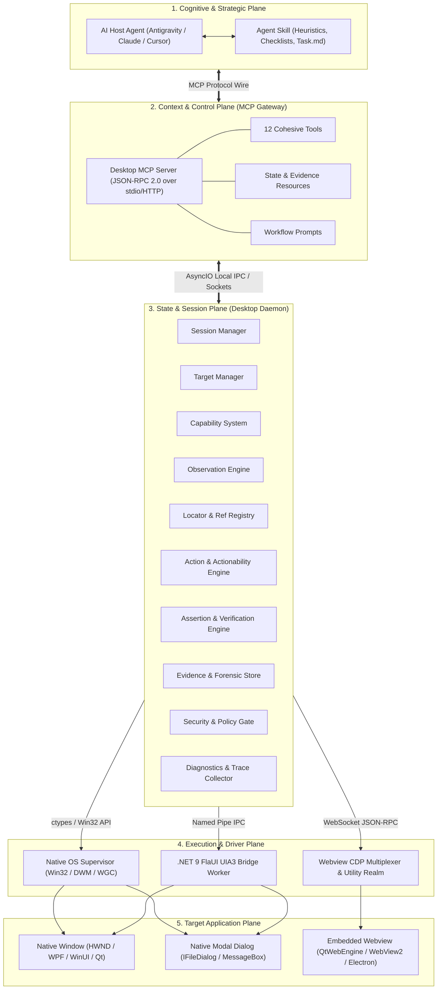
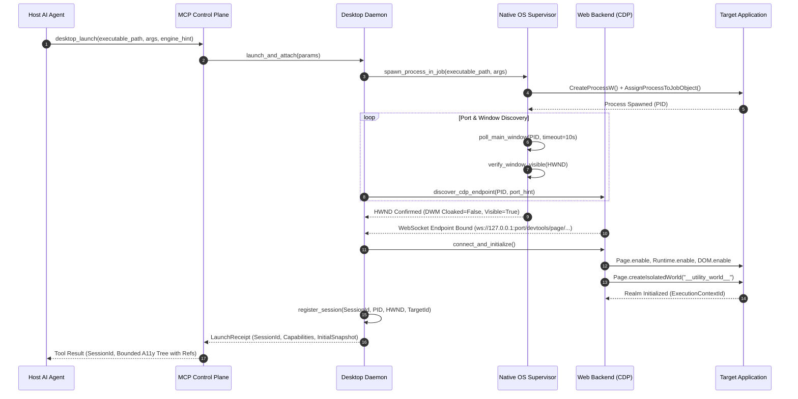
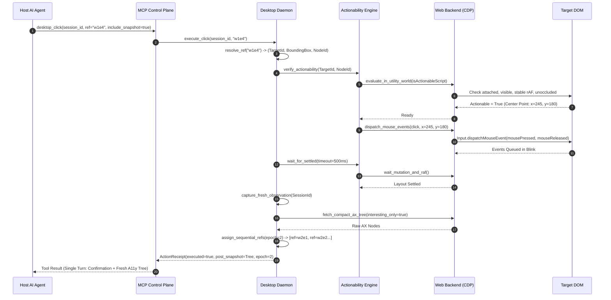
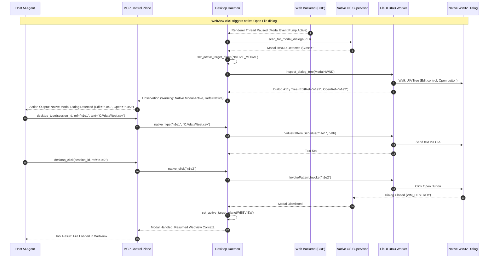
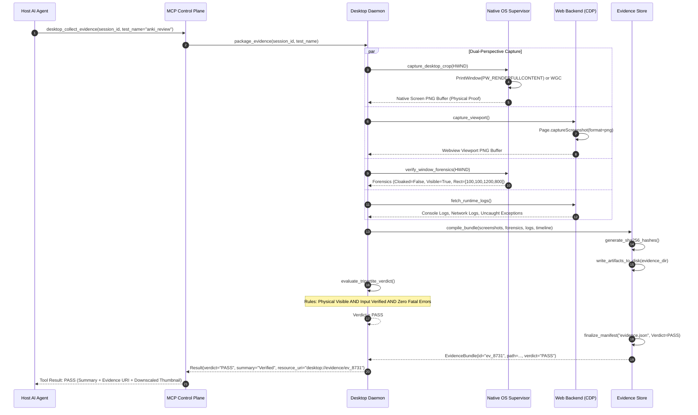

# Architecture Document 12: System Architecture

**Document ID:** `docs/architecture/12_SYSTEM_ARCHITECTURE.md`  
**Status:** APPROVED (Phase 0 Deliverable)  
**Author:** Principal Software Architect  
**Target Repository:** `desktop-webview-reviewer`  
**Layering Paradigm:** Decoupled Dual-Perspective Bridge (Architecture H)  

---

## 1. System Topology Overview

The architecture divides responsibilities across five distinct execution planes:
1. **Cognitive & Strategic Plane:** The Host AI Agent and the Agent Skill (`desktop-webview-reviewer`).
2. **Context & Control Plane:** The Model Context Protocol (MCP) server gateway.
3. **State & Session Plane:** The persistent, out-of-process Stateful Desktop Daemon.
4. **Execution & Driver Plane:** Dedicated Native OS and Webview automation backends.
5. **Target Application Plane:** The heterogeneous native and embedded webview desktop targets.

---

## 2. Component Responsibility Matrix

### 2.1 Host AI Agent
* **Responsibility:** High-level problem decomposition, test hypothesis formulation, workflow coordination, error evaluation, and final deliverable generation.
* **What It Owns:** Goal state, turn history, conversational context, strategic planning.
* **What It Must NOT Own:** Operating system handles (`HWND`), process IDs (`PID`), raw WebSocket sockets, low-level coordinate transformations, or motor control loops.
* **Dependencies:** Model Context Protocol Client SDK.
* **Communication Boundary:** Standardized JSON-RPC 2.0 over stdio or Streamable HTTP.

### 2.2 Agent Skill (`desktop-webview-reviewer`)
* **Responsibility:** Domain-specific testing strategies, checklist management (`task.md`), heuristic recovery playbooks, application-type discovery guides (e.g., Qt vs. Electron setup).
* **What It Owns:** Procedural guidance documents, task templates, verification criteria checklists.
* **What It Must NOT Own:** Direct OS execution code, persistent session registries, socket connections.
* **Dependencies:** Host Agent file viewing capabilities.
* **Communication Boundary:** In-context markdown files and skill instruction injection.

### 2.3 MCP Control Plane (Protocol Gateway)
* **Responsibility:** Bounded protocol gateway. Deserializes tool arguments, enforces JSON Schema validation, authorizes operations through the Security Gate, formats structured output (`outputSchema`), manages progress tokens, and maps passive state to MCP Resource URIs.
* **What It Owns:** Tool definitions, Resource endpoints, Prompt templates, JSON Schema models.
* **What It Must NOT Own:** Long-lived desktop application session state, direct Win32 API bindings, raw CDP connections.
* **Dependencies:** `mcp` Python SDK, `pydantic`.
* **Communication Boundary:** Protocol wire to the client; AsyncIO IPC to the Desktop Daemon.

### 2.4 Stateful Desktop Daemon
* **Responsibility:** The centralized, out-of-process host process maintaining all active session lifecycles, target bindings, locator resolution caches, and event multiplexers across transient agent connections.
* **What It Owns:** Process lifecycles, background polling loops, session leases, target registries.
* **What It Must NOT Own:** LLM reasoning, conversational memory, user-facing prompt templates.
* **Dependencies:** Python 3.11+ `asyncio`, `multiprocessing`.
* **Communication Boundary:** AsyncIO domain socket / named pipe to MCP server; internal modules.

### 2.5 Session Manager
* **Responsibility:** Manages the lifecycle of automation sessions (`SessionId`). Enforces lease timeouts, allocates target processes, orchestrates clean shutdowns, and handles client reconnection.
* **What It Owns:** Session metadata table, session locks, heartbeat monitors.
* **What It Must NOT Own:** Low-level DOM evaluation, window rectangle geometry.
* **Dependencies:** Target Manager, Process Supervisor.
* **Communication Boundary:** Internal Daemon API.

### 2.6 Target Manager
* **Responsibility:** Detects, inventories, and maintains the authoritative mapping between Native Operating System windows (`HWND`), Process IDs (`PID`), and Webview Debugging Targets (`TargetID` / WebSocket URL).
* **What It Owns:** `TargetMap`, active target pointers, HWND-to-CDP port correlation tables.
* **What It Must NOT Own:** Element locator caching, keyboard dispatch.
* **Dependencies:** Native OS Supervisor, Webview CDP Multiplexer, Discovery Engine.
* **Communication Boundary:** Internal Daemon API.

### 2.7 Capability System
* **Responsibility:** Inspects connected targets and dynamically negotiates available feature matrices (`NATIVE_UIA3`, `WEB_CDP`, `HARDWARE_SCREENSHOT`, etc.), providing fallback guidance when specific capabilities are absent.
* **What It Owns:** Capability matrices, backend compatibility flags, degradation rules.
* **What It Must NOT Own:** Action execution, error logging.
* **Dependencies:** Native OS Supervisor, Webview CDP Multiplexer.
* **Communication Boundary:** Internal Daemon API.

### 2.8 Native Backend (Native OS Supervisor & Win32 Forensics)
* **Responsibility:** Direct interaction with the Windows desktop: top-level window discovery, z-order and bounding box verification, DWM cloaking/occlusion checks, Win32 Job Object process supervision, and hardware screen capture (`PrintWindow`, DXGI, WGC).
* **What It Owns:** Native `HWND` caches, Win32 Device Contexts (`HDC`), Job Object handles.
* **What It Must NOT Own:** Internal webview DOM nodes, CSS selectors, JavaScript execution.
* **Dependencies:** Windows User32, GDI32, DWM, Kernel32 via `ctypes`.
* **Communication Boundary:** Direct Win32 C ABI.

### 2.9 Native UIA3 Bridge Worker (.NET 9 FlaUI Sidecar)
* **Responsibility:** High-speed unmanaged COM UI Automation (UIA3) inspection and control pattern invocation (`InvokePattern`, `ValuePattern`, `SelectionItemPattern`) for native desktop controls (WPF, WinUI 3, classic Win32 dialogs).
* **What It Owns:** COM `IUIAutomation` instances, MTA thread pools, native `CacheRequest` definitions.
* **What It Must NOT Own:** Webview DOM trees, CDP sockets, MCP protocol serialization.
* **Dependencies:** .NET 9/10 Runtime, `FlaUI.Core`, `FlaUI.UIA3`.
* **Communication Boundary:** Named Pipe IPC (JSON-RPC) with the Python Daemon.

### 2.10 Web Backend (CDP Multiplexer & Utility Realm)
* **Responsibility:** Manages asynchronous WebSocket connections to Chromium DevTools Protocol endpoints. Injects isolated script realms (`__utility_world__`), evaluates expressions, captures viewport composited images, and manages network/console event listeners.
* **What It Owns:** WebSocket connection pool, CDP target sessions, injected script bundles.
* **What It Must NOT Own:** Native window occlusion detection, desktop hardware coordinate translation.
* **Dependencies:** `websockets`, `aiohttp`.
* **Communication Boundary:** WebSocket RFC 6455 over TCP.

### 2.11 Observation Engine
* **Responsibility:** Captures dual-perspective application state. Serializes webview accessibility trees into compact Markdown/YAML; serializes native UIA controls into structured nodes; generates synthetic, epoch-scoped interaction references (`[ref=w1e4]`, `[ref=n1e2]`); calculates incremental UI diffs (`kind=diff`).
* **What It Owns:** Snapshot token buffers, reference mapping dictionaries, diff engines.
* **What It Must NOT Own:** Event dispatch, disk evidence storage.
* **Dependencies:** Native OS Supervisor, Webview CDP Multiplexer, Locator Registry.
* **Communication Boundary:** Internal Daemon API.

### 2.12 Locator & Reference Registry
* **Responsibility:** Maintains the authoritative mapping between ephemeral synthetic references (`ref=w1e4`) and immutable query recipes (Locators) or live target node pointers for the active observation epoch. Re-evaluates locators dynamically if a reference expires.
* **What It Owns:** `RefTable`, `LocatorCache`, epoch version counter.
* **What It Must NOT Own:** Input hardware dispatch, screenshot capture.
* **Dependencies:** Observation Engine.
* **Communication Boundary:** Internal Daemon API.

### 2.13 Action & Actionability Engine
* **Responsibility:** Executes input actions (clicks, typing, keyboard navigation, scrolling) against resolved targets. Prior to dispatch, runs the Composite Actionability Pipeline (verifying attachment, visibility, stability, enabledness, and hit-testing un-occlusion).
* **What It Owns:** Actionability verification loops, retry backoff timers, input event builders.
* **What It Must NOT Own:** Formal verdict assignment, long-term evidence archiving.
* **Dependencies:** Locator Registry, Native Backend, Web Backend.
* **Communication Boundary:** Internal Daemon API.

### 2.14 Assertion & Verification Engine
* **Responsibility:** Implements auto-retrying synchronization assertions (e.g., waiting for text, visibility, or attributes) and evaluates overall mission integrity against the Tripartite Verdict Model (`PASS`, `FAIL`, `UNVERIFIED`).
* **What It Owns:** Assertion polling loops, verdict evaluation rules, proof check ledgers.
* **What It Must NOT Own:** Motor input generation, protocol routing.
* **Dependencies:** Actionability Engine, Evidence System.
* **Communication Boundary:** Internal Daemon API.

### 2.15 Evidence System
* **Responsibility:** Collects, verifies, hashes (SHA-256), and packages immutable forensic proof bundles (native screenshots, webview screenshots, DOM snapshots, action receipts, console/network logs, trace timelines).
* **What It Owns:** Evidence directory layouts, cryptographic manifest generators, bundle zip packagers.
* **What It Must NOT Own:** Transient memory caches, target session state.
* **Dependencies:** Native OS Supervisor, Web Backend, Filesystem.
* **Communication Boundary:** Internal Daemon API; exposes read-only MCP Resource URIs.

### 2.16 Security Layer & Policy Gate
* **Responsibility:** Enforces process execution allowlists, prevents filesystem directory traversal, validates input parameters, detects UIPI elevation barriers, and strictly isolates untrusted application UI text from model system prompts.
* **What It Owns:** Execution allowlists, path normalization rules, UIPI integrity analyzers.
* **What It Must NOT Own:** Domain automation logic.
* **Dependencies:** Windows Security APIs, Pathlib.
* **Communication Boundary:** Intercepts all incoming MCP tool calls prior to Daemon routing.

---

## 3. Core Interaction Sequence Diagrams

### 3.1 Application Launch and Dual-Perspective Attachment

---

### 3.2 Action-Observation Fused Turn Execution

---

### 3.3 Native Modal Dialog Detection & Hand-Off

---

### 3.4 Evidence Collation & Tripartite Verdict Generation

