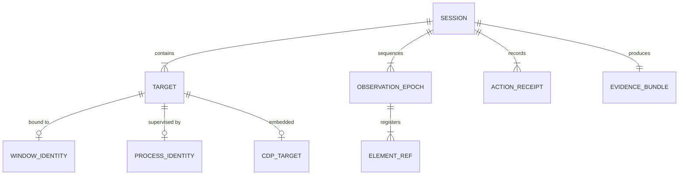
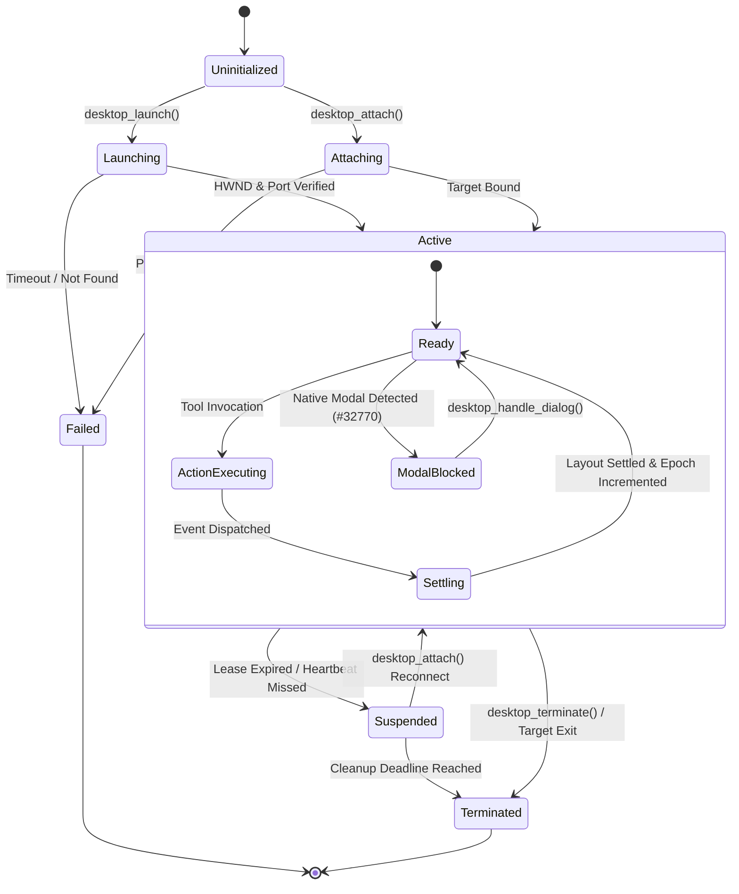

# Architecture Document 15: Session & State Model

**Document ID:** `docs/architecture/15_SESSION_STATE_MODEL.md`  
**Status:** APPROVED (Phase 0 Deliverable)  
**Author:** Principal Software Architect  
**Target Repository:** `desktop-webview-reviewer`  

---

## 1. State Topology & Distribution

Automation state is strictly partitioned across architectural layers to prevent state-drift, zombie connections, and token exhaustion:

```
State Boundary Distribution
┌───────────────────┬────────────────────────────────────────────────────────────────────────┐
│ Architectural Layer│ State Owned & Maintained                                               │
├───────────────────┼────────────────────────────────────────────────────────────────────────┤
│ Host AI Agent     │ Strategic intent, conversational turn history, high-level test plan    │
│ Agent Skill       │ Task checklist (task.md), domain heuristics, failure recovery rules    │
│ MCP Server        │ Protocol wire transport context, client capability flags, auth tokens  │
│ Stateful Daemon   │ Session leases, target bindings, epoch counters, ref lookup tables     │
│ Native Backend    │ Win32 HWND handles, Job Objects, Device Contexts (HDC), DWM state      │
│ Webview Backend   │ WebSocket client, CDP Target IDs, utility world executionContextIds    │
└───────────────────┴────────────────────────────────────────────────────────────────────────┘
```

> **The Single Source of Truth Rule:** The **Stateful Desktop Daemon** is the sole authoritative owner of desktop session state. The Host Agent and MCP Server hold zero raw OS handles or network sockets.

---

## 2. Core Entity Definitions



1. **Session (`SessionId`):** The top-level logical container representing an active testing or automation lifecycle. Bound to a unique GUID and an expiring lease (default 300s).
2. **Target (`TargetId`):** A controllable graphical entity. May be a Native Window (`HWND`), a Child Window, or an Embedded Webview (`Page`).
3. **Process Identity:** The immutable tuple `(PID, CreationTime, BinaryPath, JobObjectHandle)` identifying the host OS process.
4. **Window Identity:** The mutable tuple `(HWND, Title, Bounds, Visible, Cloaked, ZOrder)` representing the top-level OS window surface.
5. **CDP Target:** An active Chromium target (`TargetID`, `type: "page"`, `ws_url`).
6. **Observation Epoch (`EpochId`):** A monotonically increasing integer counter incremented whenever target UI state mutates or a new observation snapshot is generated.
7. **Element Reference (`ElementRef`):** An ephemeral, sequential alphanumeric token (`[ref=w1e4]`) bound strictly to a specific `EpochId` and target coordinate.
8. **Action Receipt:** An immutable record of an executed command, duration, and settlement status.
9. **Evidence Bundle:** Cryptographically sealed collection of visual and structural proofs.

---

## 3. Detailed Solutions to Classical State Hazards

### 3.1 Windows PID Reuse Protection
* **The Hazard:** Windows aggressively recycles Process IDs. If an application crashes and Windows reassigns its PID to a critical system service (e.g., `svchost.exe`), naive scripts kill the wrong process.
* **The Solution:** The Daemon never identifies a process solely by PID. Identity is defined as:
  $$\text{ProcessKey} = \text{PID} \oplus \text{ProcessCreationTime} \oplus \text{BinaryFullPath}$$
  On every operation, the Daemon queries `GetProcessTimes()` via Kernel32. If `CreationTime` differs by even 1 millisecond from the session record, the target is declared dead and all operations immediately abort.

### 3.2 Stale Interaction References Across Reactive Hydration
* **The Hazard:** Modern reactive frameworks (React 19, Vue) rebuild the DOM dynamically. A `nodeId` captured at $T_0$ is destroyed by a timer at $T_1$, causing subsequent clicks to crash.
* **The Solution:**
  1. Every `desktop_inspect` creates a new `EpochId` (e.g., Epoch 2).
  2. Element references incorporate the epoch: `w2e1`, `w2e2`.
  3. If an agent attempts to click `w1e4` while Epoch 2 is active, the Daemon intercepts the call.
  4. **Automatic Locator Re-evaluation:** If the ref carries an associated query recipe (e.g., `role=button, text="Submit"`), the Daemon attempts an instantaneous local re-query in Epoch 2. If it resolves uniquely, the action succeeds seamlessly; otherwise, it returns a structured `StaleReferenceException`.

### 3.3 CDP Disconnection & Reconnection
* **The Hazard:** Target app navigation or internal crash drops the WebSocket channel, severing automation.
* **The Solution:** The Web Backend runs an asynchronous exponential backoff reconnection loop (100ms, 250ms, 500ms, 1000ms up to 10s). The `SessionId` and native `HWND` bindings remain intact in the Daemon. When the WebSocket reconnects, the isolated utility realm is re-injected automatically, and the observation epoch is incremented.

### 3.4 Window Replacement (Destroy & Recreate Sequences)
* **The Hazard:** Applications (e.g., splash screens transitioning to main windows, or Qt login screens) destroy their initial `HWND` and create a new one under the same PID.
* **The Solution:** The Target Manager listens for Win32 `EVENT_OBJECT_DESTROY` and `EVENT_OBJECT_CREATE` via a lightweight Windows Event Hook (`SetWinEventHook`). When the main `HWND` closes, the Daemon enters a 3-second grace state, scanning the process tree for the successor top-level window.

### 3.5 Guaranteed Process Tree Teardown via Job Objects
* **The Hazard:** Track 09 revealed that running test suites created unmanaged orphaned subprocesses.
* **The Solution:** Every process launched via `desktop_launch` is immediately assigned to a Win32 Job Object with:
  ```c
  JOBOBJECT_EXTENDED_LIMIT_INFORMATION info;
  info.BasicLimitInformation.LimitFlags = JOB_OBJECT_LIMIT_KILL_ON_JOB_CLOSE;
  ```
  When the Daemon closes the Job Object handle (or if the Daemon crashes), Windows Kernel automatically and instantaneously terminates the entire process tree, leaving zero zombie processes.

---

## 4. Session State Machine



---

## 5. Multi-Window & Multi-Session Management

1. **Multi-Session Isolation:**
   * The Daemon maintains an in-memory concurrent map `sessions: Dict[str, SessionState]`.
   * Sessions operate with completely disjoint Job Objects, temporary evidence folders, and WebSocket connections.
   * Cross-session state leakage is structurally impossible.
2. **Multi-Window Navigation:**
   * An application owning multiple windows (e.g., Main Window + Settings Palette) exposes multiple targets under a single `SessionId`.
   * The tool `desktop_inspect(perspective="native")` inventories all child and auxiliary windows.
   * Clicks automatically switch the active target window context based on the element ref's owning window.
