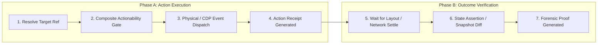
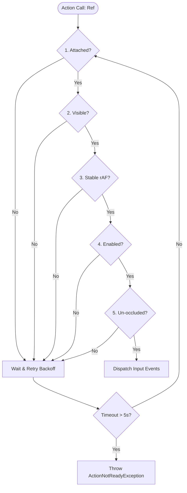
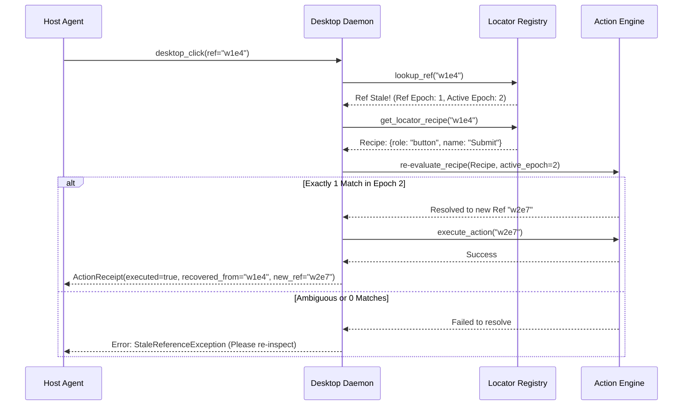

# Architecture Document 17: Action Model

**Document ID:** `docs/architecture/17_ACTION_MODEL.md`  
**Status:** APPROVED (Phase 0 Deliverable)  
**Author:** Principal Software Architect  
**Target Repository:** `desktop-webview-reviewer`  
**Inspiration Baseline:** Playwright Actionability Engine & Chrome DevTools Protocol Input Pipeline  

---

## 1. Separation of Action Execution from Outcome Verification

A catastrophic defect in conventional automation scripts is conflating **Action Dispatch** with **Outcome Achievement**:
* Calling `click()` successfully means only that a mouse event was placed into the OS message queue or Chromium input pipeline.
* It does **NOT** prove that the button clicked, that an event listener fired, that a modal appeared, or that backend state updated.

The platform enforces a non-negotiable architectural boundary:



$$\text{Action Executed} \neq \text{Outcome Verified}$$

An action tool (`desktop_click`, `desktop_type`) returns `executed: true` when Phase A succeeds. The verification engine or subsequent assertions must execute Phase B to achieve a formal `PASS` verdict.

---

## 2. Supported Action Primitives

```
Action Primitives Catalog
┌─────────────────┬──────────────────────┬──────────────────────┬────────────────────────────────────────────────────────┐
│ Primitive       │ Webview Mechanism    │ Native OS Mechanism  │ Semantic Behavior & Guarantee                          │
├─────────────────┼──────────────────────┼──────────────────────┼────────────────────────────────────────────────────────┤
│ 1. click        │ Input.dispatchMouse  │ SendInput / Invoke   │ Computes center point; checks occlusion; fires clicks  │
│ 2. type_text    │ Input.dispatchKey    │ ValuePattern / SendIn│ Emits keydown/char/keyup; triggers framework listeners │
│ 3. press_key    │ Input.dispatchKey    │ Win32 SendInput      │ Sends navigation/modifier keys (Enter, Tab, Ctrl+S)    │
│ 4. hover        │ Input.dispatchMouse  │ Win32 SetCursorPos   │ Moves cursor to element center; settles CSS hover state│
│ 5. scroll       │ Input.dispatchWheel  │ ScrollPattern / Wheel│ Scrolls container until element center is in viewport  │
│ 6. focus        │ DOM.focus / Script   │ SetFocus / UIA Focus │ Sets application keyboard focus to target affordance   │
│ 7. drag         │ Multi-step mouse drag│ Win32 SendInput Drag │ Smooth pointer interpolation across drag path          │
│ 8. select_option│ Utility Realm script │ SelectionItemPattern │ Sets dropdown option and dispatches change events      │
│ 9. handle_dialog│ Page.handleJavaScript│ Win32 Dialog Handler │ Dismisses or interacts with native/web modal dialogs   │
│ 10. window_move │ N/A                  │ SetWindowPos         │ Repositions or resizes native top-level window shell   │
└─────────────────┴──────────────────────┴──────────────────────┴────────────────────────────────────────────────────────┘
```

---

## 3. The Composite Actionability Pipeline

Prior to executing any interaction on an element reference, the Action Engine runs the **5-Point Precondition Actionability Gate**. If any check fails, the engine retries with progressive backoff until the actionability timeout (default 5,000ms) expires:



### 3.1 Point 1: Attachment
* **Webview:** Verifies that the target `nodeId` is connected to the active document root (`node.isConnected === true`).
* **Native:** Verifies that the UIA COM pointer is not stale (`UIA_E_ELEMENTNOTAVAILABLE`).

### 3.2 Point 2: Computed Visibility
* **Webview:** Evaluates computed styles:
  $$\text{Visible} \iff (\text{display} \neq \text{"none"}) \land (\text{visibility} \neq \text{"hidden"}) \land (\text{opacity} > 0.05) \land (\text{width} > 0 \land \text{height} > 0)$$
* **Native:** Checks that the window is not minimized (`IsIconic == False`), not cloaked by DWM (`DWMWA_CLOAKED == False`), and the UIA element has `IsOffscreen == False`.

### 3.3 Point 3: Motion Stability (rAFsettle)
* **Webview:** Samples the element's `getBoundingClientRect()` across two consecutive `requestAnimationFrame` cycles.
  $$\text{Stable} \iff |x_1 - x_2| \le 1\text{px} \land |y_1 - y_2| \le 1\text{px}$$
  Prevents clicks from landing on empty space during active CSS layout animations.
* **Native:** Verifies that the parent window is not actively dragging or resizing (`WM_ENTERSIZEMOVE` is inactive).

### 3.4 Point 4: Enabledness
* **Webview:** Checks that the element does not possess the `disabled` attribute or `aria-disabled="true"`.
* **Native:** Queries UIA `IUIAutomationElement::CurrentIsEnabled`.

### 3.5 Point 5: Hit-Testing & Occlusion
* **Webview:** Computes the center point $(x, y) = (\text{left} + \text{width}/2, \text{top} + \text{height}/2)$ and calls `document.elementFromPoint(x, y)`. The check passes if the hit element is the target element or one of its descendants.
* **Native:** Calls Win32 `WindowFromPoint(x, y)` to ensure the target window is top-most and not occluded by a native floating notification or another application window.

---

## 4. Strictness Enforcement (Cardinality Validation)

When an agent resolves elements via query recipes (Locators) rather than synthetic references, the Action Engine enforces **Strictness Mode by Default** (adopted from Playwright):
1. If a query resolves to **0 elements**, execution pauses and auto-waits until the element appears or timeout expires (`TargetNotFoundException`).
2. If a query resolves to **exactly 1 element**, execution proceeds immediately.
3. If a query resolves to **$\ge 2$ elements**, execution halts immediately and throws `TargetAmbiguousException`:
   ```json
   {
     "error": "TargetAmbiguousException",
     "message": "Selector 'button' resolved to 4 elements. Strict mode requires a unique match.",
     "candidates": [
       { "index": 0, "text": "Save Draft", "ref": "w1e3" },
       { "index": 1, "text": "Save & Publish", "ref": "w1e4" },
       { "index": 2, "text": "Cancel", "ref": "w1e5" },
       { "index": 3, "text": "Delete", "ref": "w1e6" }
     ],
     "remediation": "Specify unique text, role, or explicit index."
   }
   ```
   This prevents the catastrophic silent test corruption where an automation engine accidentally clicks the first button in the DOM when the user intended a specific one.

---

## 5. Stale Reference Recovery Pipeline

If the agent invokes an action with a reference token from a superseded observation epoch:



---

## 6. Action-Observation Fusion Mechanics

To eliminate multi-turn round-trip delays, mutating tools (`desktop_click`, `desktop_type`, `desktop_press_key`, `desktop_scroll`) implement **Action-Observation Fusion**:
1. Input is dispatched.
2. The Action Engine waits for layout settlement (50ms–200ms).
3. The Observation Engine automatically captures the new accessibility tree and increments the epoch.
4. The Tool Result returns both the `ActionReceipt` and the fresh `post_snapshot` tree in a single turn payload.
