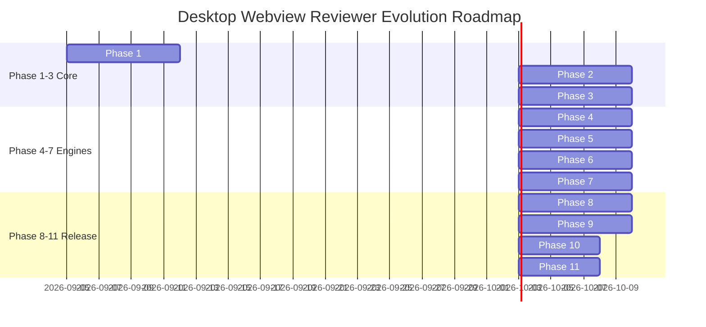

# Architecture Document 20: Migration Plan & Implementation Roadmap

**Document ID:** `docs/architecture/20_MIGRATION_PLAN.md`  
**Status:** APPROVED (Phase 0 Deliverable)  
**Author:** Principal Software Architect  
**Target Repository:** `desktop-webview-reviewer`  
**Strategy:** Incremental Non-Destructive Strangler Fig Evolution  

---

## 1. Migration Strategy & Non-Destructive Principles

The migration from the existing prototype to the universal platform must obey three iron laws:
1. **Preserve What Works:** The ~7,000 lines of working forensic code in `core/window_forensics.py`, `core/evidence.py`, `detectors/engine_detector.py`, and `adapters/` must not be discarded or arbitrarily rewritten.
2. **Strangler Fig Pattern:** New architectural subsystems (`runtime/`, `backends/`, `mcp/`) are introduced alongside existing modules. Existing modules are refactored into their new locations and backed by temporary backward-compatibility shims until all tests pass.
3. **No Code Before Spikes:** Critical uncertainties (such as the .NET FlaUI worker IPC transport and Chromium lazy accessibility freeze) must be validated via isolated technical spikes before production code integration begins.

---

## 2. Legacy Code Disposition & Migration Ledger

```
Component Migration Ledger
┌──────────────────────────────┬──────────────────┬─────────────────────────────────────┬────────────────────────────────────────────────────────┐
│ Existing Module Path         │ Classification   │ Target Destination                  │ Migration Method & Action                              │
├──────────────────────────────┼──────────────────┼─────────────────────────────────────┼────────────────────────────────────────────────────────┤
│ core/window_forensics.py     │ KEEP + REFACTOR  │ backends/native/win32_forensics.py  │ Fix 64-bit ctypes bugs; fix GDI leaks; DWM shadow crop  │
│ core/evidence.py             │ KEEP + REFACTOR  │ evidence/collector.py               │ Decouple user confirmation; fix permanent UNVERIFIED   │
│ core/models.py               │ KEEP + REFACTOR  │ core/models.py                      │ Unify enums; add Epoch, Receipt, Ref dataclasses       │
│ core/session.py              │ MOVE TO RUNTIME  │ runtime/session_manager.py & web/cdp│ Split session state from WebSocket polling loops       │
│ core/discovery.py            │ MOVE TO RUNTIME  │ runtime/target_discovery.py         │ Merge native HWND discovery with CDP port scanning     │
│ core/capabilities.py         │ KEEP + REFACTOR  │ runtime/capability_system.py        │ Upgrade to dynamic runtime negotiation matrix          │
│ core/actions.py              │ REPLACE          │ runtime/action_engine.py            │ Replace raw mouse dispatch with Actionability Pipeline │
│ core/assertions.py           │ KEEP + REFACTOR  │ runtime/assertion_engine.py         │ Add auto-retrying polling loops with timeout barriers  │
│ core/cleanup.py              │ MOVE TO RUNTIME  │ runtime/process_supervisor.py       │ Augment PID tree killing with Win32 Job Objects        │
│ detectors/engine_detector.py │ MOVE TO RUNTIME  │ runtime/discovery/engine_detector.py│ Retain detection heuristics for Electron, Qt, WebView2 │
│ adapters/base.py             │ MOVE TO BACKEND  │ backends/base.py                    │ Standardize interface for native and webview backends  │
│ adapters/qtwebengine/        │ MOVE TO BACKEND  │ backends/web/adapters/qtwebengine.py│ Retain QtWebEngine adapter; harden port discovery      │
│ adapters/webview2/           │ MOVE TO BACKEND  │ backends/web/adapters/webview2.py   │ Replace mock browser tests with embedded runtime tests │
│ adapters/electron/           │ MOVE TO BACKEND  │ backends/web/adapters/electron.py   │ Retain Electron adapter                                │
│ adapters/chromium/           │ MOVE TO BACKEND  │ backends/web/adapters/chromium.py   │ Retain CEF / Chromium adapter                          │
│ adapters/webkit/             │ DELETE           │ N/A                                 │ Prune dead Windows code (RUNTIME_UNAVAILABLE)          │
│ launchers/process_launcher.py│ MOVE TO RUNTIME  │ runtime/process_launcher.py         │ Bind with Job Objects and Security Sandbox             │
│ scripts/review.py            │ MOVE TO SKILL    │ skill/scripts/review_cli.py         │ Refactor into headless CLI client communicating with MCP│
│ scripts/attach.py            │ MOVE TO CLI      │ tools/attach_cli.py                 │ Retain as developer diagnostic attachment REPL         │
│ scripts/audit_phase*.py      │ MOVE TO EXAMPLES │ examples/benchmarks/anki/           │ Move monolithic Anki tests into benchmark suite        │
│ Untracked root fix_*.py (24) │ DELETE           │ N/A                                 │ Purge all root debugging debris and patch scripts      │
└──────────────────────────────┴──────────────────┴─────────────────────────────────────┴────────────────────────────────────────────────────────┘
```

---

## 3. Phased Implementation Roadmap (Phases 1–11)



### Phase 1: Runtime Foundation & Stateful Daemon
* **Goal:** Establish the out-of-process daemon, session leasing, and Win32 Job Object process lifecycle supervision.
* **Components:** `runtime/daemon.py`, `runtime/session_manager.py`, `runtime/process_supervisor.py`.
* **Dependencies:** Python 3.11+ `asyncio`, Kernel32 Job Objects.
* **Tests:** `tests/test_daemon_lifecycle.py`, `tests/test_job_object_cleanup.py`.
* **Exit Criteria:** Daemon spawns, leases sessions, and guarantees 100% subprocess termination on exit with zero orphan processes.
* **Risks:** Elevated process permissions crashing standard user job objects.

### Phase 2: Native OS Supervisor & Win32 Forensics Hardening
* **Goal:** Harden the existing `core/window_forensics.py` into a robust Win32/DWM supervisor.
* **Components:** `backends/native/win32_forensics.py`, `backends/native/window_supervisor.py`.
* **Dependencies:** User32, GDI32, DWM, Windows Graphics Capture.
* **Tests:** `tests/test_win32_forensics_64bit.py`, `tests/test_dwm_cloaking.py`.
* **Exit Criteria:** Fix 64-bit `GetWindowLongPtrW` pointer truncation; eliminate GDI DC leaks; correct DWM drop shadow crop offsets.
* **Risks:** Multi-monitor DPI scaling coordinate drift on mixed-DPI systems.

### Phase 3: Webview CDP Backend & Target Multiplexing
* **Goal:** Migrate CDP WebSocket mechanics out of `core/session.py` into a structured, auto-reconnecting CDP client.
* **Components:** `backends/web/cdp_client.py`, `backends/web/target_multiplexer.py`, `backends/web/utility_realm.js`.
* **Dependencies:** `websockets`, `aiohttp`.
* **Tests:** `tests/test_cdp_reconnect.py`, `tests/test_isolated_world.py`.
* **Exit Criteria:** Direct CDP connection executes expressions in isolated `__utility_world__` without polluting application V8 prototypes.
* **Risks:** Chromium targets dropping WebSocket connections during rapid page navigation.

### Phase 4: Native UIA3 .NET Bridge Worker (FlaUI Sidecar)
* **Goal:** Integrate a high-performance .NET 9/10 out-of-process worker for native semantic inspection and pattern invocation.
* **Components:** `backends/native/flaui_bridge.py`, `src/DesktopBridge.UIA3/` (C# project).
* **Dependencies:** .NET 9 SDK, `FlaUI.UIA3`.
* **Tests:** `tests/test_flaui_ipc.py`, `tests/test_native_dialog_automation.py`.
* **Exit Criteria:** Out-of-process UIA3 query executes in $<50\text{ms}$ with native `CacheRequest` and clean MTA apartment isolation.
* **Risks:** Missing .NET 9 runtime on client machine (mitigated via self-contained single-file publish).

### Phase 5: Observation Engine & Sequential Ref Registry
* **Goal:** Implement the dual-perspective observation engine with compact YAML trees, synthetic refs (`w1e4`, `n1e2`), and differential snapshots.
* **Components:** `runtime/observation_engine.py`, `runtime/ref_registry.py`, `runtime/diff_engine.py`.
* **Dependencies:** Phases 2, 3, 4.
* **Tests:** `tests/test_observation_compression.py`, `tests/test_diff_snapshot.py`.
* **Exit Criteria:** Accessibility tree snapshot consumes $<400$ tokens (90% reduction vs raw DOM); diff snapshot achieves $>85\%$ token savings.
* **Risks:** Complex DOM trees causing observation serialization latency >200ms.

### Phase 6: Action Engine & Composite Actionability Pipeline
* **Goal:** Implement the 5-point actionability gate (attached, visible, stable rAF, enabled, un-occluded) and strictness enforcement.
* **Components:** `runtime/action_engine.py`, `runtime/actionability.py`, `runtime/locator_resolver.py`.
* **Dependencies:** Phase 5.
* **Tests:** `tests/test_actionability_gate.py`, `tests/test_strictness_cardinality.py`.
* **Exit Criteria:** Actions automatically wait for animation settling; ambiguous queries throw `TargetAmbiguousException` with diagnostic candidate lists.
* **Risks:** Non-standard CSS transitions bypassing standard rAF motion detection.

### Phase 7: Verification Engine & Evidence Hardening
* **Goal:** Repair the "Permanent UNVERIFIED" regression, implement the Tripartite Verdict Model, and generate cryptographic evidence manifests.
* **Components:** `evidence/collector.py`, `evidence/manifest.py`, `runtime/verification_engine.py`.
* **Dependencies:** Phases 2, 6.
* **Tests:** `tests/test_verdict_evaluation.py`, `tests/test_evidence_provenance.py`.
* **Exit Criteria:** Automated test runs achieve `Verdict.PASS` with valid dual-perspective visual and functional proofs; CLI returns exit code 0.
* **Risks:** GDI screen capture returning black bitmaps on hardware-accelerated DirectComposition surfaces.

### Phase 8: MCP Control Plane (12 Cohesive Tools)
* **Goal:** Implement the Model Context Protocol server exposing the 12 cohesive tools, state resources, and workflow prompts.
* **Components:** `mcp/server.py`, `mcp/tools/*.py`, `mcp/resources/*.py`, `mcp/prompts/*.py`.
* **Dependencies:** FastMCP / official `mcp` SDK, Phase 1–7 runtime.
* **Tests:** `tests/test_mcp_tool_contracts.py`, `tests/test_mcp_stdio_transport.py`.
* **Exit Criteria:** All 12 tool schemas validate against MCP specification; dual-modal visual payloads prevent 64 KB stdio buffer deadlock.
* **Risks:** JSON-RPC parsing overhead in large batch operations.

### Phase 9: Agent Skill & Workflow Orchestration
* **Goal:** Update the `desktop-webview-reviewer` agent skill to drive the MCP control plane and manage autonomous testing workflows.
* **Components:** `SKILL.md`, `skill/workflows/*.md`, `skill/checklists/*.md`.
* **Dependencies:** Phase 8.
* **Tests:** `tests/test_skill_workflow_simulation.py`.
* **Exit Criteria:** AI host agents seamlessly execute complete end-to-end review workflows using the updated skill instructions.
* **Risks:** Model hallucinating obsolete CLI parameters from historical skill versions.

### Phase 10: Security Hardening & Prompt Injection Defense
* **Goal:** Enforce process execution allowlists, filesystem sandboxing, UIPI detection, and untrusted UI data enveloping.
* **Components:** `security/policy_gate.py`, `security/sanitizer.py`.
* **Dependencies:** Phase 8.
* **Tests:** `tests/test_prompt_injection_isolation.py`, `tests/test_security_sandboxing.py`.
* **Exit Criteria:** Injected prompt payloads inside webview DOM fail to alter agent instructions; directory traversal attempts are blocked.
* **Risks:** Overly restrictive binary allowlists blocking legitimate developer test fixtures.

### Phase 11: End-to-End Adversarial Validation & Packaging
* **Goal:** Validate the platform against real-world target applications (Anki QtWebEngine, StudyLab WebView2, VS Code / Electron) across the 37 attack dimensions.
* **Components:** `tests/e2e/`, `scripts/benchmark_osworld.py`.
* **Dependencies:** All previous phases.
* **Tests:** Full test suite execution across Windows 10 and Windows 11.
* **Exit Criteria:** 100% test pass rate; zero zombie processes; zero leaked handles; published standalone package.
* **Risks:** Workstation environment differences (antivirus software blocking named pipes).

---

## 4. Architecture Readiness Verdict

```text
# ARCHITECTURE READINESS VERDICT

NOT READY — ARCHITECTURE SPIKES REQUIRED
```

### Mandatory Technical Spikes Required Before Implementation:

1. **Spike 1: .NET FlaUI UIA3 Out-of-Process IPC Performance & Marshaling:**
   * *Target:* Validate whether a lightweight C# CLI worker communicating over Windows Named Pipes or stdio JSON-RPC consistently achieves $<50\text{ms}$ query latency with zero COM apartment leaks compared to in-process `pythonnet`.
   * *Exit Gate:* 100 consecutive scoped UIA cache requests execute in $<50\text{ms}$ each without memory growth.
2. **Spike 2: Chromium Lazy Accessibility Tree Freeze Mitigation:**
   * *Target:* Determine the precise combination of Chromium launch flags (`--force-renderer-accessibility` vs `--enable-features=...`) that prevents Chromium from freezing its UI thread when queried via external Windows UIA in live PyQt6 and WebView2 applications.
   * *Exit Gate:* Native UIA tree walk of a running QtWebEngine application completes in $<200\text{ms}$ without throwing `RPC_E_SERVERCALL_REJECTED`.
3. **Spike 3: Per-Monitor V2 Fractional DPI Coordinate Translation:**
   * *Target:* Build and test a Win32 coordinate translation helper that maps webview CSS viewport coordinates to physical screen pixels across mixed DPI setups (e.g. 100% primary + 175% secondary monitor) accounting for DWM non-client margins.
   * *Exit Gate:* Hardware mouse click lands within $\pm 2$ physical pixels of the calculated element center across all monitors.
