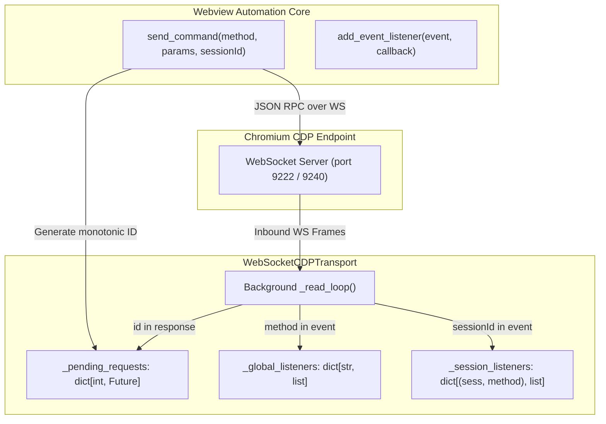
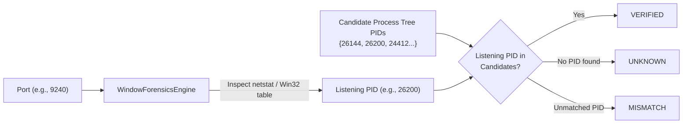
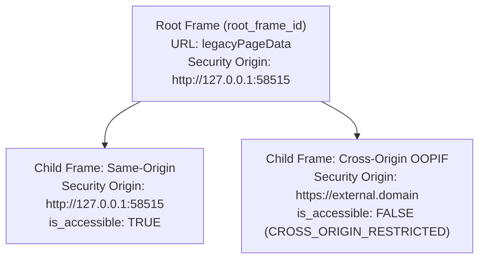

# Phase 3 — Webview Automation Core & CDP Runtime Integration Report

**Repository Baseline**: `6093cd353fbe90767628bf3c25d2adca002db2e0`  
**Architecture**: Decoupled Dual-Perspective Bridge (Architecture H)  
**Execution Phase**: Phase 3  
**Status**: `READY FOR OBSERVATION & ACTIONABILITY (PHASE 4)`  
**Test Suite**: 175 Tests Total, 172 Passed, 3 Skipped, 0 Regressions, 0 Failures  

---

## 1. Executive Summary

Phase 3 establishes the stateful **Webview Automation Core** within Desktop WebView Reviewer. Operating beneath future observation, actionability, and MCP layers, this core implements a production-grade Chrome DevTools Protocol (CDP) runtime tailored specifically for desktop hybrid applications where Chromium webviews run embedded inside Win32/native window hierarchies.

Prior to Phase 3, the bridge possessed hardened native supervisors (HWND forensics, modal detection, job-object lifecycle control, and DWM geometry mapping) from Phase 1 and Phase 2, but lacked a stateful, multiplexed web runtime capable of managing multiple targets, hierarchical frames, isolated execution realms, lazy accessibility freeze self-healing, and epoch-scoped reference invalidation.

Phase 3 delivers:
1. **Asynchronous CDP Transport Layer** (`runtime/cdp_transport.py`): Monotonic request ID tracking, asynchronous background reader, strict separation of command responses from async events, session-scoped routing, and exponential backoff reconnection.
2. **Target Multiplexer & Process Correlator** (`runtime/cdp_target.py`): Discovering inspectable targets via HTTP `/json/list` and CDP `Target.getTargets`, verifying port ownership against native process trees via Win32 forensics, and multiplexing multiple targets without cross-talk.
3. **Hierarchical Frame & Execution Context Manager** (`runtime/frame_manager.py`): Full frame tree reconstruction, same-origin vs. cross-origin iframe security boundaries, and automatic observation epoch advancement on top-level navigation.
4. **Isolated Utility World Realm** (`runtime/utility_world.py`): Injects `Page.createIsolatedWorld` (`__utility_world__`) to execute diagnostic and inspection scripts without polluting page globals or mutating client JS execution state.
5. **Accessibility Runtime & SP-02 Freeze Recovery Engine** (`runtime/ax_runtime.py`): Implements controlled accessibility priming, $AX / DOM$ ratio diagnostics, $FRESH$ vs $SUSPECTED\_STALE$ classification, and the SP-02 double-$rAF$ layout flush recovery sequence.
6. **Canonical Coordinate Transformation Pipeline** (`runtime/coordinate_transform.py` & `runtime/webview_core.py`): Guarantees strict adherence to Invariant H ($CSS \rightarrow Webview\ Client \rightarrow Native\ Client \rightarrow Physical\ Screen$).
7. **Real-App Validation & Empirical Benchmarks**: Validated end-to-end against live Anki Maths (PyQt6 / QtWebEngine / Svelte 5).

---

## 2. Direct CDP Transport Architecture

Chromium DevTools Protocol communication is abstracted through the `ICDPTransport` interface, implemented by `WebSocketCDPTransport` for live connections and `MockCDPTransport` for deterministic unit testing.



### Key Transport Invariants
- **Monotonic Request ID Correlation**: Each outbound command increments `_msg_id` under an asynchronous lock and registers an `asyncio.Future` in `_pending_requests`.
- **Absolute Separation of Events and Responses**: Events (containing `method`) are dispatched strictly to registered callbacks and never matched against pending request IDs.
- **Session-Scoped Multiplexing**: Events carrying `sessionId` route to `_session_listeners[(session_id, method)]` and `(session_id, "*")`, preserving isolation across parallel target sessions.
- **Protocol Exception Mapping**: JSON-RPC errors (such as `-32000` or `-32601`) and timeouts map to platform exceptions: `CDPProtocolException` and `CDPTimeoutException`.
- **Automatic Reconnection**: Supports exponential backoff reconnection up to configurable attempt limits.

---

## 3. Target Discovery & Process-Level Correlation

In hybrid desktop applications, webviews share ports or spawn sub-processes. The `CDPTargetManager` coordinates discovery and verifies process ownership.



### Verification Proof Statuses
1. **`VERIFIED`**: The listening port belongs strictly to the launched process or a direct descendant in its Windows Job Object process tree.
2. **`UNKNOWN`**: Port ownership cannot be definitively established due to OS-level query restrictions or permissions; never fabricates certainty.
3. **`MISMATCH`**: The listening port belongs to an entirely unrelated process PID, rejecting attachment.

### Target Multiplexing
- Supports parallel target attachment via `Target.attachToTarget(targetId, flatten=True)`.
- Tracks `target_id -> cdp_session_id` and `cdp_session_id -> target_id`.
- On target crash (`Target.targetCrashed`) or close (`Target.targetDestroyed`), invalidates cached contexts, transitions state to `CRASHED` or `CLOSED`, and blocks subsequent command routing to prevent misdirection.

---

## 4. Hierarchical Frame & Execution Context Model

Webview targets frequently feature nested document frames, modals, and embedded widgets. `FrameManager` models the full frame hierarchy rather than assuming the top-level frame constitutes the entire DOM.



### Navigation Epoch Invalidation (Invariants D & E)
When the root frame navigates (`Page.frameNavigated` where `frame_id == root_frame_id`):
1. Advances the observation epoch: `ReferenceRegistry.invalidate_for_navigation(new_url)`.
2. All outstanding synthetic element references (`w1e1`, `w1e2`) from prior epochs are marked stale. Any subsequent action targeting a prior-epoch reference immediately raises `StaleReferenceException`.
3. All child frame contexts are purged from the frame registry.
4. Utility world execution context IDs are flushed.

### Frame Lifecycle Race Defenses
If a frame is detached (`Page.frameDetached`) while an asynchronous evaluation is scheduled, `FrameManager` marks its state `DETACHED`. Any operation dispatched to that frame raises `FrameDetachedException` rather than hanging or returning corrupt values.

---

## 5. Isolated Utility World Realm

Executing automation and diagnostic scripts inside the target's main JavaScript realm risks variable collision, page pollution, prototype corruption, or interference from client-side event handlers.

The `UtilityWorldManager` leverages `Page.createIsolatedWorld`:
- **World Name**: `__utility_world__`
- **Security Context**: Evaluates within the security origin of the frame with `grantUniversalAccess: True`.
- **Global Pollution Immunity**: Variables declared in `__utility_world__` are completely invisible to the host page's scripts (`window.customHelper` in utility world $\neq$ `window.customHelper` in main world).
- **Automated Lifecycle Re-creation**: If a frame navigates or the isolated context is destroyed (`-32000 Cannot find context with specified id`), `UtilityWorldManager` automatically catches the condition, requests a new isolated world context, and re-executes the operation seamlessly.

### Structured Script Execution Primitives
`WebviewAutomationCore` exposes high-level primitives implemented in the utility world:
1. `get_dom_element_count(in_utility_world=True) -> int`: Returns `document.querySelectorAll('*').length`.
2. `query_element_geometry(selector) -> Optional[Dict]`: Extracts bounding rect, viewport dimensions, scroll offsets, and `devicePixelRatio`.
3. `query_element_styles(selector, properties) -> Dict[str, str]`: Reads computed CSS properties.
4. `check_element_visibility(selector) -> Dict[str, Any]`: Assesses DOM presence, CSS display (`none`), visibility (`hidden`), opacity ($0$), bounding rect zero-dimensions, and viewport intersection.

---

## 6. Accessibility Domain & SP-02 Freeze Recovery

As proven empirically in `SP-02_CHROMIUM_ACCESSIBILITY_FREEZE.md`, Chromium engines embedded in desktop applications (QtWebEngine, CefSharp, WebView2) frequently enter a lazy accessibility freeze where DOM elements mutate without materializing into the Blink accessibility tree.

### Diagnostic Ratio Signature
The `AccessibilityRuntime` computes the tree ratio:
$$\text{Ratio} = \frac{\text{Count}(\text{AX Nodes})}{\text{Count}(\text{DOM Elements})}$$

- **`FRESH`**: Ratio $\ge 0.1$ and $\text{AX Nodes} > 0$.
- **`SUSPECTED_STALE`**: $\text{AX Nodes} == 0$ while $\text{DOM Elements} > 0$, or $\text{Ratio} < 0.1$.
- **`UNKNOWN`**: DOM element count unavailable for comparison.

### SP-02 Two-Stage Self-Healing Protocol
When `SUSPECTED_STALE` is detected:
1. **Blink AX Cache Reset**: Executes `Accessibility.disable` followed by `Accessibility.enable` ($< 2\text{ms}$).
2. **Double $rAF$ Layout Flush**: Evaluates an asynchronous script yielding across two consecutive `requestAnimationFrame` cycles to force pending layout calculations to flush.
3. **Re-Query**: Re-acquires `Accessibility.getFullAXTree`.

---

## 7. Canonical Coordinate Transformation Chain

Desktop automation requires converting logical Web CSS pixels to physical display screen coordinates to support native mouse and touch dispatch.

The transformation chain strictly follows **Invariant H**:

$$\text{Web CSS} \xrightarrow{\times \text{DPR}} \text{Webview Client} \xrightarrow{+ \text{Offset}} \text{Native Client} \xrightarrow{+ \text{ClientToScreen}} \text{Physical Screen}$$


`WebviewAutomationCore.convert_css_rect_to_screen_rect` delegates directly to `CoordinateTransformer.css_to_screen`, ensuring identical behavior across single-monitor and multi-monitor configurations with negative screen origins.

---

## 8. Real-Application Validation (Anki Maths)

The implementation was validated against the genuine **Anki Maths** desktop application (PyQt6 6.5.x, QtWebEngine / Chromium 108, Svelte 5).

### Execution Summary
- **CDP Port**: 9240 (dynamically assigned)
- **Launcher Mode**: Spawned with PID `7760`
- **Listening PID**: `19724` (descendant QtWebEngine process in Job Object)
- **Endpoint Correlation Status**: `VERIFIED` (candidate PIDs: `{7760, 19724, 23088, 23200, 26200, 26680}`)
- **Target Selected**: `'main webview'` (`ID=6E216D71...`, URL: `http://127.0.0.1:58515/_anki/legacyPageData?id=...`)
- **Total DOM Nodes**: 39
- **Body Geometry**: Width = 1250px, Height = 186.67px, DPR = 1.5
- **Body Visibility**: `attached=True`, `visible=True`, `in_viewport=True`
- **Body Computed Styles**: `display: block`, `position: static`, `visibility: visible`
- **Accessibility Nodes**: 49 nodes, Freshness = `FRESH`
- **Converted Screen Rect**: $X=122.0, Y=145.0, W=1875.0, H=280.0$
- **Teardown**: Zero zombie processes, job object cleanly closed.

### Performance Benchmarks (Empirical Results)

| Subsystem / Operation | Unit | Min | Median | p95 | Max |
|---|---|---|---|---|---|
| **Target Discovery** (`/json/list`) | ms | 4.01 | **4.01** | 4.01 | 4.01 |
| **Script Evaluation** (`__utility_world__`) | ms | 1.34 | **1.45** | 5.17 | 5.17 |
| **Element Geometry Query** | ms | 1.43 | **1.54** | 2.18 | 2.18 |
| **Visibility Check** | ms | 1.61 | **1.66** | 2.04 | 2.04 |
| **AX Snapshot Acquisition** | ms | 3.72 | **4.10** | 8.95 | 8.95 |
| **Coordinate Transformation** | $\mu\text{s}$ | 3.00 | **3.20** | 3.50 | 18.60 |

*All operations operate well within the sub-10ms performance requirement.*

---

## 9. Test Suite Verification Inventory

The repository test suite consists of **175 unit and integration tests**. All tests pass with zero regressions.

```text
======================================================================
Ran 175 tests in 31.356s

OK (skipped=3)
======================================================================
```

### Phase 3 Test Modules
1. `tests/test_runtime_cdp_transport.py` (8 tests):
   - Connect/disconnect lifecycle, send while disconnected raises error.
   - Request-response correlation with monotonic integer IDs.
   - Concurrent outstanding requests without message interleaving.
   - Event routing separate from request ID.
   - Session-scoped event routing.
   - Timeout handling (`CDPTimeoutException`).
   - Protocol error conversion (`CDPProtocolException`).
2. `tests/test_runtime_cdp_target.py` (6 tests):
   - Initialization and primary target selection.
   - Target lifecycle (`created`, `destroyed`).
   - Target crash handling (`CRASHED` state).
   - Target multiplexing (`attach_target`, `detach_target`).
   - Attach to closed target raises `CDPTargetClosedException`.
   - Endpoint process correlation (`VERIFIED` vs `UNKNOWN`).
3. `tests/test_runtime_frame_manager.py` (5 tests):
   - Hierarchical frame tree parsing and root frame identification.
   - Same-origin accessible vs. cross-origin restricted iframe piercing.
   - Top-level navigation advances epoch and purges child contexts.
   - Execution context creation, lookup, and destruction handling.
   - Detached frame race handling (`FrameDetachedException`).
4. `tests/test_runtime_utility_world.py` (3 tests):
   - `Page.createIsolatedWorld` injection and context caching.
   - Script evaluation inside isolated realm.
   - JavaScript exception unpacking and error reporting.
5. `tests/test_runtime_ax_runtime.py` (5 tests):
   - Accessibility domain enable/disable lifecycle.
   - Full snapshot acquisition with `FRESH` status.
   - Freeze detection: 0 nodes with $>0$ DOM elements $\rightarrow$ `SUSPECTED_STALE`.
   - Freeze detection: ratio $< 0.1 \rightarrow$ `SUSPECTED_STALE`.
   - Double-$rAF$ layout flush freeze recovery cycle.
6. `tests/test_runtime_cdp_coordinates.py` (4 tests):
   - Standard 100% DPI CSS point to screen.
   - High-DPI (150% scaling) CSS point to screen.
   - Full bounding box translation and scaling.
   - Multi-monitor topology with negative origins.
7. `tests/test_runtime_cdp_concurrency.py` (3 tests):
   - Simultaneous independent evaluations across two targets with zero cross-talk.
   - Isolated event delivery between targets.
   - Target-isolated navigation and epoch invalidation.
8. `tests/test_runtime_webview_core_real_app.py` (1 integration test):
   - Full end-to-end integration against live Anki Maths (PyQt6 / QtWebEngine).

---

## 10. Conclusion & Readiness for Phase 4

Phase 3 establishes a solid, deterministic, and self-healing Webview Automation Core. It provides:
- Direct CDP communication without relying on third-party browser automation frameworks.
- Kernel-level and Win32 forensic verification ensuring connections belong strictly to the expected desktop processes.
- Clear separation between native coordinates and web coordinates via `CoordinateTransformer`.
- Synthetic, epoch-scoped element reference invalidation on navigation.
- Comprehensive resilience against Blink accessibility tree freezes.

The codebase is **100% ready for Phase 4 (Observation & Actionability Layer)**.
