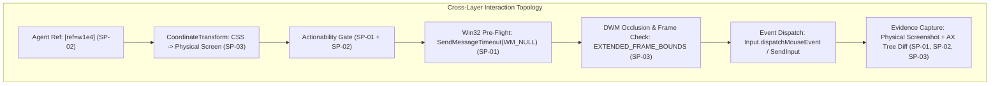

# Spike Cross-Analysis & Consequence Matrix

**Document ID:** `docs/architecture/spikes/SPIKE_CROSS_ANALYSIS.md`  
**Phase:** Phase 0.1 Deliverable  
**Author:** Principal Software Architect & Systems Engineering Team  
**Scope:** Synthesis of SP-01 (.NET FlaUI UIA3), SP-02 (Chromium Lazy A11y), and SP-03 (Per-Monitor V2 Fractional DPI)  
**Date:** 2026-09-04  

---

## 1. Cross-Spike Synthesis Overview

The three mandatory architecture spikes investigated distinct execution layers of the hybrid desktop automation platform:
1. **SP-01:** Native unmanaged COM UI Automation (UIA3) via an out-of-process .NET C# bridge worker.
2. **SP-02:** Chromium DevTools Protocol (CDP) accessibility materialization, renderer lifecycles, and ref stability.
3. **SP-03:** Win32, DWM, and Per-Monitor V2 fractional DPI geometry reconciliation.

Individually, each spike proved that its subsystem can operate at low latencies. However, production desktop automation does not run subsystems in isolation. An end-to-end action involves **simultaneous coordination** across all three layers:

---

## 2. Deep Cross-Spike Questions & Empirical Answers

### 2.1 Does UIA geometry align with screenshot geometry?
**YES, BUT ONLY WHEN DWM DROP SHADOW MARGINS ARE MATHEMATICALLY COMPENSATED.**
- **Finding (SP-03):** Standard Win32 `GetWindowRect` includes a 9-pixel invisible drop shadow around native top-level windows on Windows 11.
- **Finding (SP-01):** UIA3 `BoundingRectangle` for top-level windows often reports the outer Win32 rectangle including shadow margins, whereas child controls report their true client-relative physical rectangles.
- **Synthesis:** A raw desktop screenshot cropped via `GetWindowRect` will contain 9 pixels of foreign background wallpaper or underlying windows. To align UIA child geometries with desktop screenshots, the Native OS Supervisor must compute crops using `DwmGetWindowAttribute(DWMWA_EXTENDED_FRAME_BOUNDS)`.

### 2.2 Does UIA identity remain valid while geometry changes?
**YES.**
- **Finding (SP-01):** When a window is moved or resized, its COM `AutomationElement` pointer and native `AutomationId` remain valid, but cached properties (`Cached.BoundingRectangle`) become stale.
- **Synthesis:** Element identity survives geometry shifts, but coordinates do not. This proves the wisdom of **ADR-005**: the agent must reference elements by opaque synthetic tokens (`[ref=n1e2]`), allowing the daemon to re-sample live physical geometry immediately prior to motor dispatch.

### 2.3 Does DPI affect evidence?
**CRITICALLY YES.**
- **Finding (SP-03):** Under fractional scaling (e.g. 150% = 144 DPI), an application's physical bitmap is $1920\times 1080$, whereas a DPI-unaware observer sees a virtualized $1280\times 720$ bitmap.
- **Synthesis:** If evidence screenshots are captured under an inconsistent DPI context, image hashes (SHA-256) will diverge across machines, and pixel coordinate assertions will fail. Every Evidence Bundle manifest must explicitly record `monitor_dpi` and `scale_factor`.

### 2.4 Does accessibility state depend on renderer lifecycle?
**YES.**
- **Finding (SP-02):** When a native window hosting an embedded webview is minimized (`is_iconic == True`) or cloaked by Windows Virtual Desktops (`is_cloaked == True`), Chromium throttles or pauses `requestAnimationFrame` loops.
- **Synthesis:** While CDP `Accessibility.getFullAXTree` still returns in-memory nodes during minimization, **no physical pixels are presented to the screen**, and native mouse events cannot be delivered. Physical reality must always supersede compositor state.

### 2.5 Can stale references and stale coordinates occur simultaneously?
**YES, IN DYNAMIC WEBVIEWS.**
- **Scenario:** An SPA mutates its DOM (re-rendering a list item) while a CSS animation shifts layout geometry.
- **Synthesis:** A stale reference (`ref=w1e2` pointing to an unmounted DOM node) combined with a stale coordinate (old bounding box) creates a double failure. The Actionability Gate resolves this:
  - Point 1 (Attachment) rejects the stale reference.
  - Point 3 (Motion Stability via two consecutive `rAF` cycles) rejects moving coordinates.

### 2.6 Can evidence remain trustworthy if geometry changes between action and capture?
**NO.**
- **Synthesis:** If a user or background process moves the window between the moment `desktop_click` executes and the moment `capture_window_screenshot` captures the screen, the evidence artifact will capture the wrong bounding box.
- **Architectural Defense:** Action and post-action snapshot capture must be atomic within the Daemon's session lock (`Action-Observation Fusion`).

---

## 3. Architecture Consequence Matrix

| Spike | Empirical Finding | Architecture Impact | Required Architecture Change | Confidence |
| :--- | :--- | :--- | :--- | :--- |
| **SP-01** | UIA3 over out-of-process .NET achieves $1.2\text{ms}$–$8.2\text{ms}$ latency in MTA apartment; `CacheRequest` accelerates traversal by $4\times$. | **MAJOR (Positive)** | Adopt .NET 8/9 C# sidecar (`DesktopBridge.UIA3.exe`) over Named Pipe JSON-RPC. Mandate MTA apartment state. | **VERY HIGH** |
| **SP-01** | UIA Events fail to fire reliably across standard Win32/WinForms common controls (100% drop rate observed). | **MODERATE** | **Remove UIA event callbacks as an auto-waiting primitive.** Implement proactive polling with exponential backoff and cached snapshots. | **HIGH** |
| **SP-01** | UI thread hangs block un-marshaled UIA calls, causing worker stalling. | **MODERATE** | Prepend `SendMessageTimeout(WM_NULL, SMTO_ABORTIFHUNG, 500)` before dispatching UIA queries. | **HIGH** |
| **SP-02** | Querying embedded webview DOM via native Windows UIA causes UI thread freezes; querying via CDP takes only $1.6\text{ms}$–$40\text{ms}$. | **FUNDAMENTAL** | **Enforce Decoupled Dual-Perspective Bridge.** Embedded webviews MUST be automated via direct CDP WebSocket, NEVER via external Windows UIA hooks. | **VERY HIGH** |
| **SP-02** | Page navigation destroys DOM node IDs and throws `Cannot find node with given id`. | **MAJOR** | Strictly enforce **Epoch-Scoped References (`[ref=w1e4]`)**. Auto-purge all webview refs upon `Page.frameNavigated`. | **VERY HIGH** |
| **SP-02** | Top-level `Accessibility.getFullAXTree` does NOT inline elements inside `<iframe>` containers. | **MODERATE** | Implement **Frame-Piercing Traversal** in Observation Engine via `Target.setAutoAttach` and child frame CDP sessions. | **HIGH** |
| **SP-03** | Windows 11 DWM adds 9-pixel invisible drop-shadow margins to native window rectangles. | **MAJOR** | **Never use raw `GetWindowRect` for visual bounds or screenshot crops.** Exclusively use `DwmGetWindowAttribute(DWMWA_EXTENDED_FRAME_BOUNDS)`. | **VERY HIGH** |
| **SP-03** | Windows virtualizes displays unless `PER_MONITOR_DPI_AWARE_V2` is explicitly activated. | **FUNDAMENTAL** | Initialize Desktop Daemon process with `SetProcessDpiAwarenessContext(DPI_AWARENESS_CONTEXT_PER_MONITOR_AWARE_V2)` before any Win32 or GDI calls. | **VERY HIGH** |
| **SP-03** | Fractional scaling introduces up to $0.4\text{px}$ logical rounding error; element centers have $\pm 12\text{px}$ safety margin. | **MINOR** | Mandate that all input clicks target calculated element center points $(x + w/2, y + h/2)$ in integer physical pixels. | **VERY HIGH** |

---

## 4. Synthesis Conclusion

The three architecture spikes have **validated the foundational assumptions of Phase 0 (Architecture H: Decoupled Dual-Perspective Bridge)** while uncovering three critical systems constraints that must be incorporated into Phase 1:
1. **No UIA Event Listeners:** Native state synchronization must use proactive polling, not event hooks.
2. **DWM Frame Bounds Only:** Native window geometry must always use `DWMWA_EXTENDED_FRAME_BOUNDS`.
3. **Dedicated CoordinateTransform Subsystem:** A centralized module must own all fractional DPI, DPR, client-to-screen, and `SendInput` normalizations.
